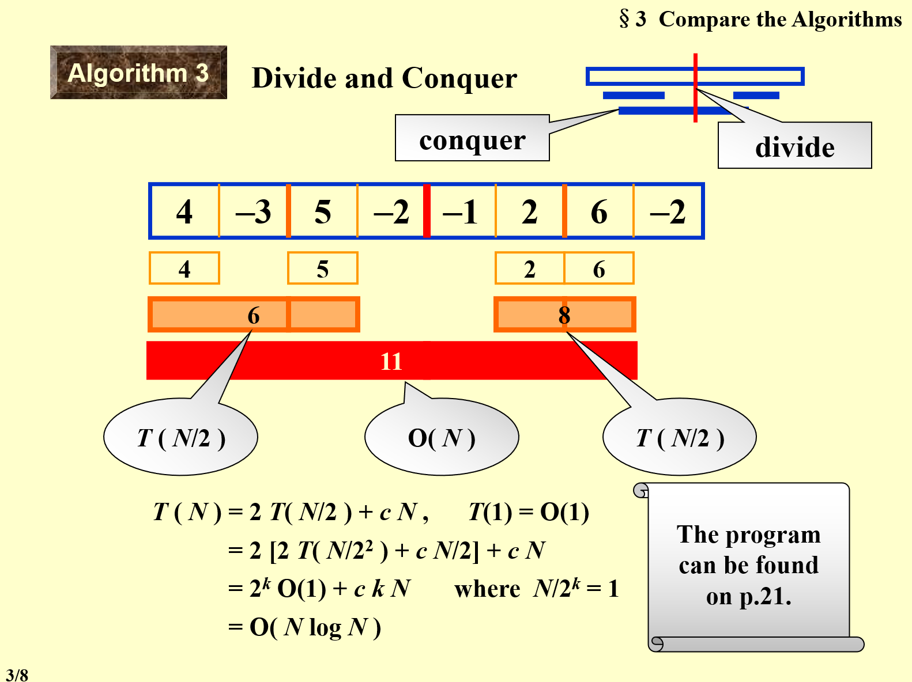
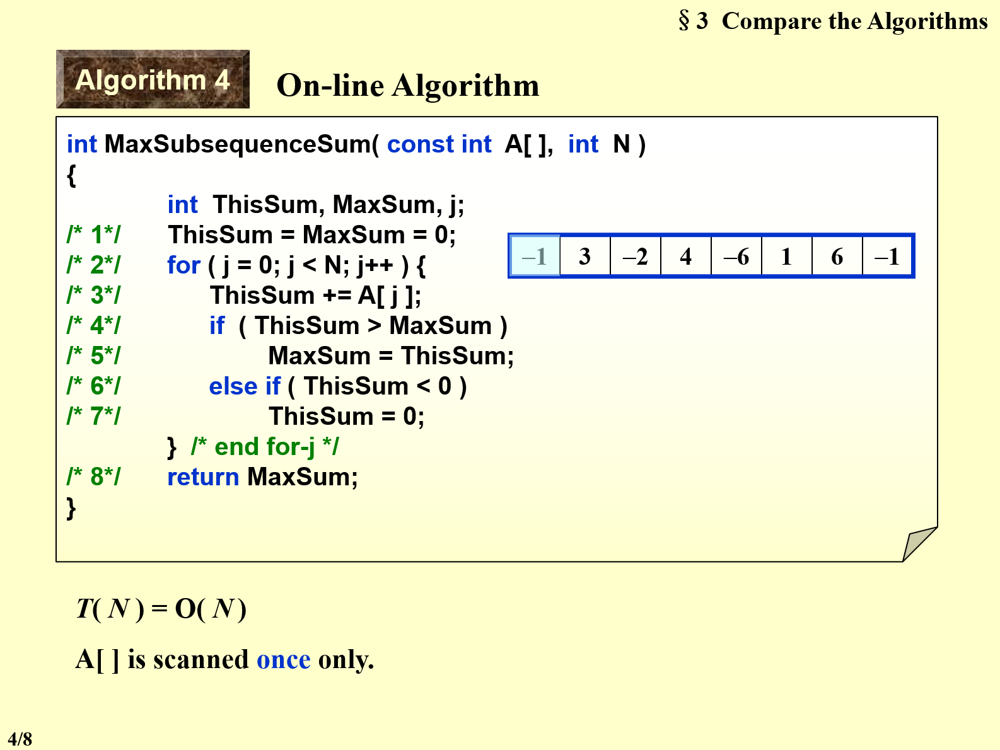
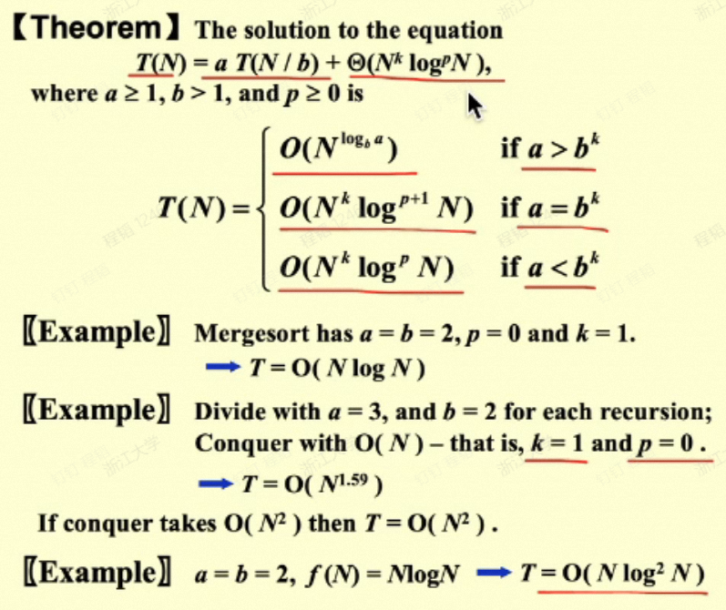
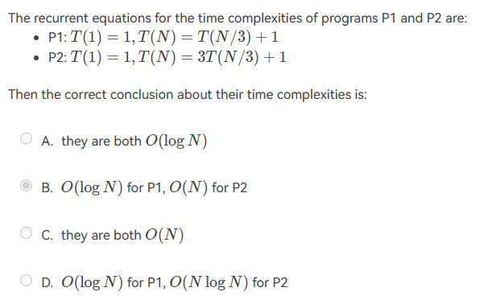
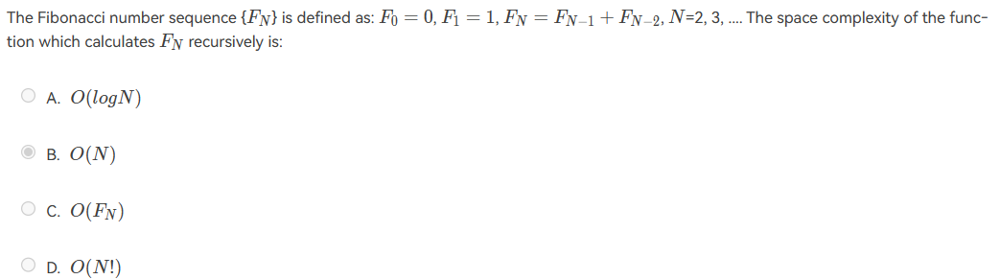

# Complexity: Asymptotic Notation

- $T(N)=O(f(N))$ if there are positive constants $c$ and $n_0$ such that $T(N)\le cf(N)$ for all $N\ge n_0$
	- Big O 代表一种**上界**，小于等于
- $T(N)=\Omega(g(N))$ if there are positive constants $c$ and $n_0$ such that $T(N)\ge cg(N)$ for all $N\ge n_0$
	- Big Omega 代表一种**下界**，大于等于
- $T(N)=\Theta (h(N))$ if and only if $T(N)=O(h(N))$ and $T(N)=\Omega(h(N))$
	- Big Theta 代表上下界同阶，是**确界**
- $T(N)=o(p(N))$ if $T(N)=O(p(N))$ and $T(N)\ne \Theta(p(N))$ 
	- Small o 代表**严格渐进上界**，严格小于

## Rules of Asymptotic Notation

- $T_1(N)=O(f(N))\,\, T_2(N)=O(g(N))$ 
	- $T_1(N)+T_2(N)=\mathrm{max}(O(f(N)),O(g(N)))$
	- $T_1(N)*T_2(N)=O(f(N)*g(N))$
- $log^kN=O(N)$ for any constant $k$, **logarithms grow very slowly**

## General Rules

- `if/else`
	- 上界是不同选择中 runtime 最大的
- Recursions
	- 使用递推数列来计算
	- for example: Fibonacci number
		- $T(N)=T(N-1)+T(N-2)+2$
		- $(\frac{3}{2})^N\le Fib(N) \le (\frac{5}{3})^N$ *grows exponentially*

# Compare the Algorithms

## MaxSubsequenceSum problem

### Divide and Conquer



- 先 divide，找到每个最小单元（单个数）返回这个数
- 然后 conquer，需要进行判断
	- 如果两个子序列连起来（加上中间部分）大于等于原来的两个子数列，则取这个大的
	- 反之，取子序列中较大的‘

### On-line Algotithm



- 使用 ThisSum 记录这个子序列的和
	- 如果 ThisSum 小于零，说明这个位置前面的子序列已经为负数，可以抛弃，重置 ThisSum 为 0
	- 如果 ThisSum 大于 MaxSum，说明找到了新的最大和

# Recursion Analysis



- 只需要记得前面的指数为 $\log_ba$ 需要和后面的 $k$ 进行比较 

> [!example] 
> -  $T(N)=2T(N/2)+N$ -> $O(NlogN)$
> - $T(N)=2T(N/2)+N\log N$ -> $O(N\log^2 N)$

# HW

## Euclid's Algorithm 求 GCD *最大公约数*

- 辗转相除法 $\mathrm{gcd}(a,b)=\mathrm{gcd}(b, a\,\mathrm{mod}\,b)$
	- 大除小
		- 有余数，则计算小除余数
		- 直到出现整除，输出最后那个除数就是答案

```c
int gcd(int a, int b) {
    while(b^=a^=b^=a%=b);	// 交换ab，并计算a/b的余数
    return a;
}
```

## Exponentiation 快速幂

- 例如计算 $7^{10}$ 可以看作 $7^{(101010)_2}=7^{2^5}*7^{2^3}*7^{2^1}$
- 根据公式 $n^{2^{m-1}}*n^{2^{m-1}}=n^{2^m}$ 快速计算出所有的 $7^{2^1}, 7^{2^2}, 7^{2^3}, 7^{2^4}, 7^{2^5}$ 然后选择其中用到的量算出结果即可

## PTA

- 
	- 可能需要自己算一下，也可以记住这个答案
	- 这其实很简单，上面的显然是 log，下面的因为每次除三又乘三，所以是 O(N)
- 
	- 空间复杂度等于递归深度，而由于存在 $F_{N-1}$，最大递归深度为 N