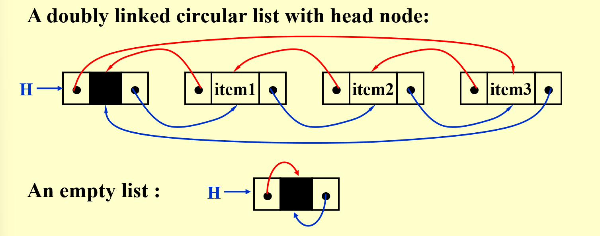
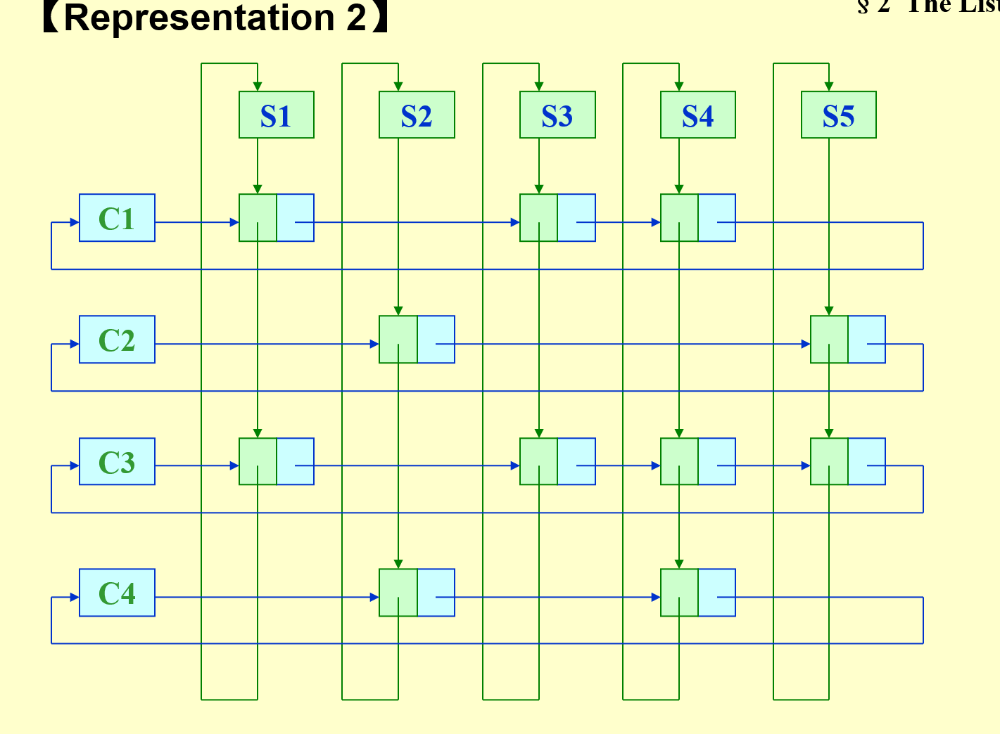
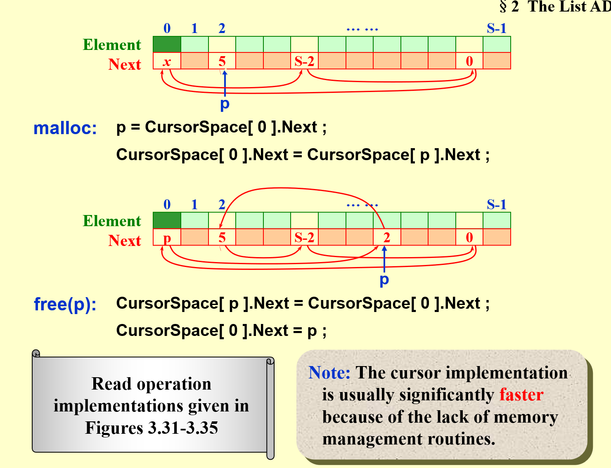
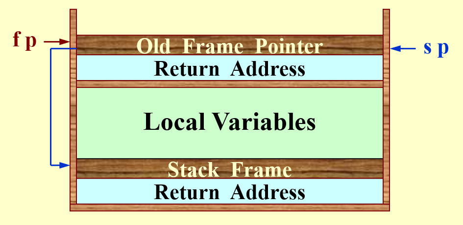
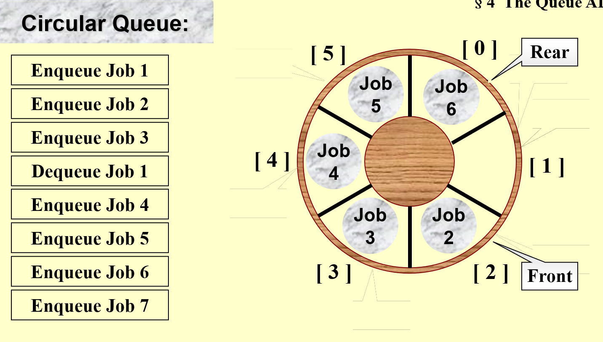
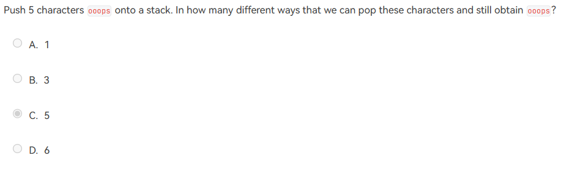
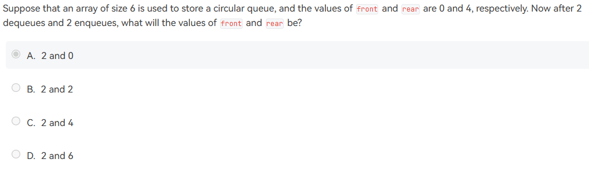

# Abstract Data Type (ADT)

- $Data Type = \{Objects\} \cup \{Operations\}$
- ADT: The *specification* on objects and *specification* of the operations on the objects are **separated from** the *representation* of the objects and *implementation* on the operations.
	- 封装，函数化编程，不考虑具体实现

# The List ADT

## Operations

- FindLength
- PrintList
- MakeEmpty
- FindKthElement
- InsertAfterKth
- Delete
- FindNext
- FindPrevious

## Implementation

- Array
	- 需要提前估计容量
	- 插入删除 O(N)，移动数据
	- 查找 k-th O(1)

### Linked List

- 使用 dummy head node，可以删除第一个

### Doubly Linked Circular Lists

- 方便查找 previous

## Two Applications

### The Polynomial ADT 多项式表示

- *coefficient* 系数 *exponent* 指数
- Operations
	- FindDegree 找到最高次项指数
	- Addition
	- Subtration
	- Multiplication
	- Differentiation

#### Representation 1

- 对于稀疏数组，过于复杂

#### Representation 2

### Multilists

[Ch.09 Graph Algorithms#Adjacency Multilists](Ch.09 Graph Algorithms.md#adjacency-multilists) 也使用到了 multilist 的思想

For example, represent the relationship between students and the courses. **Array would be too complex in space**

- 每个节点表示一个 pair relationship，节点内要存储学生编号和课程编号

> [!NOTE]- HW: Sparse matrix representation
> 1. **坐标列表（Coordinate List, COO）**：
>    在这种表示中，矩阵被表示为三个数组：行索引、列索引和数据值。每个非零元素由其行索引、列索引和值组成。
> 2. **压缩稀疏行（Compressed Sparse Row, CSR）**：
>    CSR 表示由三个数组组成：非零元素的值、行指针和列索引。行指针数组指向列索引数组中每个行的起始位置。这种表示方式适合于行操作，如行的插入和删除。
> 3. **压缩稀疏列（Compressed Sparse Column, CSC）**：
>    CSC 与 CSR 类似，但是是按照列来组织的。它包含三个数组：非零元素的值、列指针和行索引。列指针数组指向行索引数组中每个列的起始位置。这种表示方式适合于列操作。
> 4. **字典式（Dictionary of Keys, DICTIONARY）**：
>    这种表示方法使用字典（或哈希表）来存储非零元素的位置和值，键是元素的索引对（行索引，列索引）。
> 5. **块稀疏矩阵（Block Sparse Matrix）**：
>    当矩阵的稀疏性在子矩阵级别上时，可以使用块稀疏矩阵表示。这种表示将矩阵分割成小块，并且只存储那些非零的块。
> 6. **带状稀疏矩阵（Banded Sparse Matrix）**：
>    当非零元素仅出现在矩阵的主对角线附近的几条对角线上时，可以使用带状稀疏矩阵表示。这种表示通常包含对角线宽度和非零元素。

### Cursor Implementation of Linked Lists (no pointer)

- 维护一个  ，等价为从 0 开始的循环链表
- malloc，就是在  中删去 0 之后的节点
- free，就是将一个节点添加到  0 之后

> [!hint] Title
> - malloc 可以看出  总是队尾的空位，且队尾的下一个一定是空的
> - free 操作的原理
> 	- 将原本队尾第一个空位放在要删除的元素后面
> 	- 将  指向要删除的元素

# The Stack ADT

## Operations

- 满的 stack push error
- 空的 stack pop error

## 实现方法

### 链表实现

- dummy head 指向栈顶元素，相当于链表插入头节点
- 出栈需要  ，但是可以使用一个  链表来存储所有 pop 出来的元素，减少  的次数有利于提升性能

### 数组实现

- **一定要封装好**，不能让主程序能够直接读取非栈顶元素
- 对于 *pop, push* 需要进行检查

## Application

### Balancing Symbols

- 检查字符串中的括号等是否能过够配对
- On-line $T(N)=O(N)$

### Postfix Evaluation

#### 逆波兰表达式

-   **infix** expression 中缀表达式
-  **prefix** expression 前缀表达式
-  **postfix** evalution 逆波兰表达式

#### 操作方法

- 遇到元素，入栈
- 遇到符号，把栈顶两个元素拿出来处理，结果再入栈
- 算完之后输出栈内唯一元素

### Infix to Postfix Conversion

#### 没有括号的话

- 读到元素直接输出
- 读到符号
	- 如果栈顶符号优先级 $\ge$ 当前读到的符号，**出栈**
	- 否则，**入栈**
- 最后 pop 剩余的符号

#### 有括号

a\*(b+c)-d -> 

- 读到元素直接输出
- 读到符号（包括括号）
	- if 读到 ，**入栈**
	- else if 读到 ，**一直出栈到左括号**
	- else if 栈顶不是  && 栈顶符号优先级 $\ge$ 当前读到的符号，**出栈**
	- else **入栈**

> [!NOTE] 可以理解为
> - 读到  一定入栈
> - 读到  才能让  出栈，而且中间的全部出栈
> - 其他一样

> [!attention] 注意，这个问题需要单独分析
> Note:  a – b – c will be converted to a b – c –.  However, 2^2^3 ( $2^{2^3}$ ) must be converted to 2 2 3 ^ ^, not 2 2 ^ 3 ^ since exponentiation associates right to left.

### Function Calls - System Stack

- 系统里有两个指针，分别是 **sp, stack pointer** **fp, frame pointer**
- 尾递归可以优化成循环，编译器可以实现这种优化
- 递归会消耗大量系统资源，效率很低
	- **能用递归完成的操作都一定可以不用递归完成**

# The Queue ADT

- 与栈相反，first in first out
- 尾部插入，队首取出

## 实现

### Array Implementation

### Circular Queue

- 队列首尾相接，相当于数组最后添加元素添加到数组的开头
- Rear 默认在 0，Front 默认在 1
	- Enqueue 时， 在  加入 job
	- Dequeue 时，删去  的 job，
	- Rear 和 Front 差 2 认为是满栈，差 1 认为是空栈

# HW

- Sequential List 就是顺序表，**就是数组**
- 
	- 由于 ps 不能变位置，只有前面的三个 o 可以以任意顺序输出
	- 这样找到所有的可能
		- i i i o o o
		- i i o ...
			- i i o i o o
			- i i o o i o
		- i o i ...
			- i o i i o o
			- i o i o i o
		- i o o 不允许，已经空
- 
	- 结合 [Circular Queue](#circular-queue) 内容思考