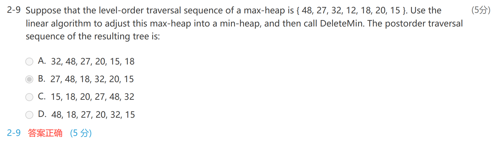

# ADT Model

> [!NOTE] Priority queues
> delete the element with the highest / lowest priority

- Objects: A finite ordered list with zero or more elements
- Operations

```c
PriorityQueue Initialize( int MaxElements );
void Insert( ElementType X, PriorityQueue H );
ElementType DeleteMin( PriorityQueue H );
ElementType FindMin( PriorityQueue H );
```

# Simple Implementations

## Array

- Insertion, $\Theta(1)$
- Deletion
	- find the largest / smallest $\Theta(n)$
	- remove the item and shift array $O(n)$

## Linked List **Usually Best**

- Insertion
	- add to the *front* $\Theta(1)$
- Deletion
	- find $\Theta(n)$
	- remove $\Theta(1)$
- **Why best**
	- deletion 永远比 insertion 小，inserrtion 次数多，使得插入更小就好

## Ordered Array

- Insertion
	- find the proper position $O(n)$
	- shift $O(n)$
- Deletion: delete the last $O(1)$

## Ordered Linked List

- Insertion:
	- find position $O(n)$
	- insert $\Theta(1)$
- Deletion: delete first/last item $\Theta(n)$

## Binary Search Tree

- 由于总是删除左下角的节点，二叉树一定会不平衡
- 维护一个平衡二叉树？ **AVL Tree** in ads

# Binary Heap

## Structure Property

### Definition

- A binary tree with n nodes and height h is **complete** iff its nodes correspond to the nodes numbered from 1 to n in the prefect binary tree of height h. 也就是完全二叉树，但是只有前 n 个节点

> [!hint] 完全二叉树 [Ch.04 Trees](Ch.04 Trees.md)
> - **Complete** Binary Trees: 完全二叉树 ^bfe95b
> 	- 除了最后一层，全都填满
> 	- 最后一层从左往右填

- 对于一个高度为 h 的二叉树，有 $[2^h,2^{h+1}-1]$ 个元素
	- $h=\lfloor\log_2 N\rfloor$

### Array Representation

- **使用 BT[N+1]**，第零个 index 实际没有用
- for any node with index i, we have:
	- 父亲为 i/2 向下取整
		- $parent(i)=\,\lfloor i/2\rfloor (i\ne 1), \space None(i=1)$
	- 左孩子为 2i
		- $left\_child(i)=\,2i(2i\le n),\space None(2i>n)$
	- 右孩子为 2i+1
		- $right\_child(i)=\,2i+1(2i+1\le n),\space None(2i+1>n)$
- 初始化的时候，在第零个 index 设置一个最小的值，称为 sentinel *哨兵*

```c
PriorityQueue Initialize( int MaxElements )
{
	PriorityQueue H;
	if(MaxElements < MinPQSize) return Error("Priority queue size is too small");  // too small size, no need for a queue
	H = malloc(sizeof(struct HeapStruct));
	if(H == NULL) return FatalError("Out of space!!");
	/*allocate the array plus one extra for sentinel*/
	H->Elements = malloc((MaxElements + 1)*sizeof(ElememtType));
	if(H->ELements == Null) return FatalError("Out of space!!");
	H->capacity = MaxElements;	// max allowed num of elements
	H->Size = 0;	// current, no elements
	H->Elements[0] = MinData;  // sentinel
	return H;
}
```

## Heap Order Property

- 最小树：每个节点的值都不比孩子大
- 最小堆：是一个完全二叉树，也是一个最小树，*最小值在根*
- 最大堆，*最大值在根*

## Basic Heap Operations

### Insertion

- 插入之后树的结构是一定的，因为要保持 index 连续
- 插入到新开的节点，如果比父节点大，就互换，并递归比较互换 **Percolate Up**

```c
void insert( ElementType X, PriorityQueue H )
{
	int i;  // node ptr
	if(isFull(H)){
		Error("Priority queue is full!!");
		return;
	}
	
	for(i = ++H->size; H->Element[i/2] > x; i/=2){    // 零号有哨兵，不需要判断是否为根节点
		H->Elements[i] = H->Elements[i/2];    // Procolete up, dont swap!!!
	}
	
	H->Elements[i] = x;
}
```

### DeleteMin

- 先把最大 index 的元素写到根节点
- 找到根节点左右孩子中最小的，如果比它大，与其交换 **Percolate Down**
- 递归调用
- $O(logn)$

```c
ElementType DeleteMin( Priority Queue H)
{
	int i, Child;  // ptrs
	ElementType MinElement, LastElement;
	if(IsEmpty(H)){
		Error("Priority queue is empty");
		return H->Elements[0];    // return the sential
	}
	MinElement = H->Elements[1];    // save the smallest
	LastElement = H->Elements[H->Size--];    // take last and reset szie
	for(i = 1; i*2 <= H->Size; i = Child){    // find smaller child
		Child = i*2;    // find left child
		if(Child != H->Size && H->ELements[Child+1] < H->Elements[Child]) Child++;    // if there is smaller right child, jump to it
		if(LastElement > H->Elements[Child]) H->Elements[i] = H->Elements[Child];    // percolate down one level
		else break;    // proper postion found
	}
	H->Elements[i] = LastElement;   // put it there
	return MinElement;
}
```

### Other Heap Operations

#### DecreaseKey(P, delta, H) *Percolate up*

- Lower the value of the key in the *heap H* at *position P* by a positive amount of *delta*
- 同样，取出，然后 percolate*这样不需要 swap*，找到正确位置写入

#### IncreaseKey(P, delta, H) *Percolate down*

- Increases the value ofthe key in the *heap H* at *position P* by a positive amount of *delta*
- 取出，然后 percolate *注意要找比较小的孩子*，找到正确位置，写入

#### Delete(P, H) *删除第 P 个元素*

- DecreaseKey(P, infty, H); DeleteMin(H); *变成根节点，然后 deleteMin*

#### BuildHeap(H) *将一个数组排列成堆*

- 先构建堆（写入数组）
- PercolateDown(7, 6, 5, 4, ....)
	- **从 index 最大的父节点开始** percolate down
- 时间复杂度
	- 考虑满二叉堆，一共 $2^{h+1}-1$ 个节点，所有节点的高度之和 $2^{h+1}-1-(h+1)$，所以：
		- $T(N)=O(N)$
	- 如果使用 insert 操作，每次 logN，一共执行 N 次，效率较低

# Applications of Priority Queues: Find the kth largest element

- 建立最大堆
- 进行 k-1 次 deleteMin，每次 $\log N$
- $T(N)=O(N)$

# d-Heaps

- 所有的 node 都有 d 个孩子，比如 3-heap
- 事实上，计算的时候 \*2 和 /2 都是移位操作，所以 binary 最快

# Exercises

## HW 6

### 2-2

- Using the linear algorithm to build a min-heap from the sequence {15, 26, 32, 8, 7, 20, 12, 13, 5, 19}, and then insert 6. Which one of the following statements is FALSE?
	- A. The root is 5
	- B. The path from the root to 26 is {5, 6, 8, 26}
	- C. 32 is the left child of 12
	- D. 7 is the parent of 19 and 15

- 什么是 *linear algorithm* ?
	- 先将元素写成堆的样子
	- 然后从最后一个父节点开始 `PercolateDown`

### Complete Binary Search Tree

- sort the input array
- inorder write into the CBT
- print
- 仍然要注意 `(*p)++` 的问题

## Midterm

- In the binary MAX heap built from the array { 25, 14, 28, 51, 27, 11, 33, 20, 39, 23 }, the index of 39 is 1 (note that the index starts from 0)
	- 这里都说了 index 从 0 开始，就不要按照 heap 的定义来了

### Review

- 
	- 直接将这个 max heap percolate down，这就是 *linear algorithm* 的含义