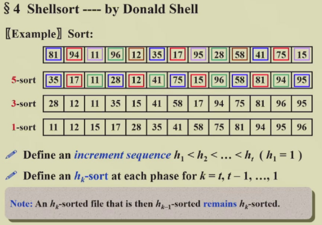
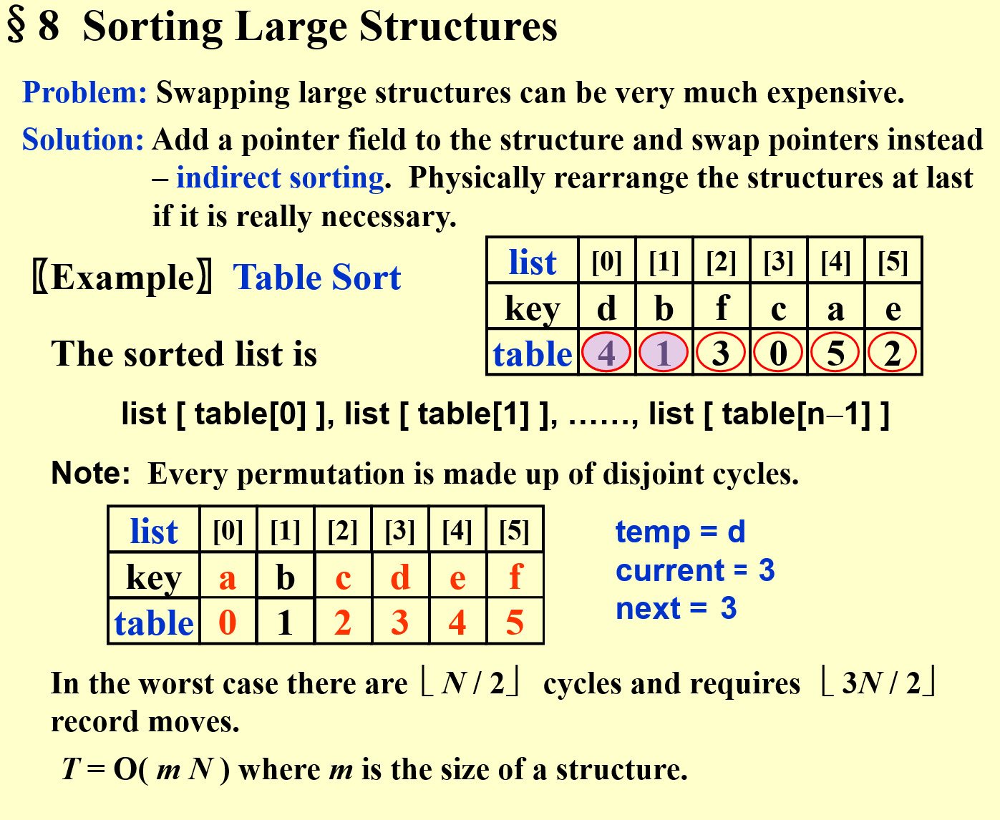
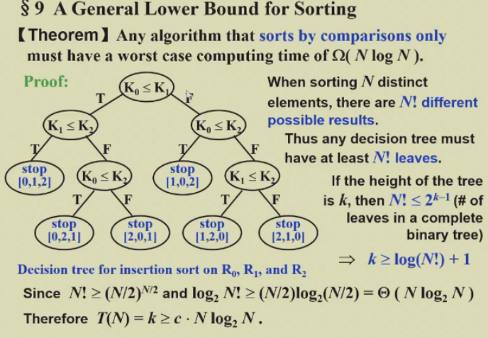
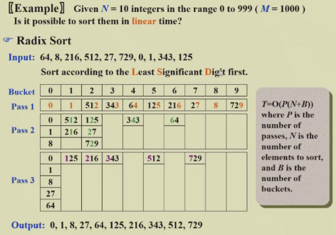
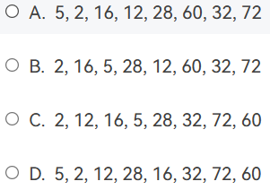

# Preliminaries

- N must be a legal integer
- Assume integer array for the sake of simplicity
- '>' and '<' operators exist and are the only operations allowed on the input data
- internal sorting *内部排序*

# Insertion Sort

- worst case, decending sequence, $T=O(N^2)$
- best case, $T=O(N)$

# A Lower Bound for Simple Sorting Algortihms

- An **Inversion** *逆序对，index 大小和值的大小相反*，类比逆序数问题，假设逆序数为 n
- There are $n$ swaps needed to sort this list by insertion sort
- $T(N, I)=O(I+N)$ $I$ 
	- 至少需要数组过一遍 $N$
	- 每个逆序对都需要 swap $I$
	- 如果本来就接近于排好了，那么接近于 $O(N)$ Linear
- The average number of inversion in an random array of N distinct numbers is $N(N-1)/4$
- Any sorting algorithm that sorts by *exchanging* adjacent elements requires $\Omega(N^2)$ time on average

## Improvement

- 每次排序交换相隔比较远的两个元素

# Shellsort

- 定义序列 $h$，然后进行多次排序，每次 $h$ 减小，直到最后 $h=1$

## Naive Shellsort

$h_t=\lfloor N/2\rfloor,\,h_k=\lfloor h_{k+1}/2\rfloor$

 

### Worst-Case Analysis

- $Theorem$: The worst-case running time of Shellsort is $\Theta(N^2)$
- *bad-case*可能出现前面 $h>1$ 排完都不变，最后一次排才排好的情况
- sequence 选择**素数**会有更好的效果

## Hibbard's Increment Sequence

- $h_k=2^k-1$
- $Theorem$: The worst-case running time of Shellsort, using Hibbard's increments, is $\Theta(N^{3/2})$
- $Conjectures$
	- $\overline T_{Hibbard}(N)=O(N^{5/4})$
	- Sedgewick's best sequence is $\{9*4^i-9*2^i+1\} \cup \{4^i-3*2^i+1\}$
		- $T_{avg}(N)=O(N^{7/6})$  $T_{worst}(N)=O(N^{4/3})$

# Heapsort

- 如果不需要知道所有的顺序，只需要知道*最大/最小*的几个值，那么 Heapsort 更快

## Algorithm 1

-  $T(N)=O(N\log N)$
- con: The *space requirement* is doubled.

## Algorithm 2

- 不如直接将  的结果写道数组的后面去

- $Note$ that  is a valid entry *第零个也是要排序的有效元素*
- 对于任意的数组，平均比较次数 $2N\log N-O(N\log\log N)$
- $Note$ Although Heapsort gives the *best average time*, in practice it is slower than a version of Shellsort that uses Sedgewick's increment sequence *因为常数比较大*

# Mergesort

## Merge two sorted lists

- $T=O(N)$
- 两个 pointer，小的放入新数组，并且 ptr 右移一位，直到 ptr 都到达末尾

## Mergesort

- 为什么要在外部定义 
	- **减少**内存申请和释放
	- 减少空间开销，递归深度 $\log N$，每层都要 $N$ 长度数组，$S(N)=O(N\log N)$

$$
\begin{aligned}
T(1)&=1\\
T(N)&=2T(N/2)+O(N)\\
&=2^kT(N/2^k)+k*O(N)\\
&=N*T(1)+\log N*O(N)\\
&=O(N+N\log N)
\end{aligned}
$$

- **pro**: 适用于 *外部排序*
- **cons**
	- 需要更多空间 $S(N)=O(N)$
	- 数组的复制时很慢的

# Quicksort

## The Algorithm

- Complexity
	- Best case:  $T(N)=O(N\log N)$
		- 每次  的选择都是中位数
	- Average case: $T(N)=O(N\log N)$
- Property
	- 每次的  在后续的排序中**位置不会变化**，*快的原因*
	-  选择和  是容易错的地方

## Picking the Pivot

- *A Wrong Way* 
	- Worst case: if  is **presorted**, $O(N^2)$
- *A Safe Maneuver* 
	- 随机数产生浪费资源
- **Median-of-Three Partitioning**
	-  取其中的中位数

## Partition Strategy

- Double Pointer
	-  和 ，从两边往内走，直到一个
- **如果 **
	-  和  都停下来进行 
		- 虽然可能存在不必要的交换 $\{1,1,1,1,1,1,1,1\}$
		- 但是至少保证了划分的两部分大小相近
			- 否则 $T(N)=O(N^2)$

## Small Arrays

- **Problem**: Quicksort is slower than insertion sort for small $N\le 20$
- **Solution**: N 比较小时，就调用 

## Implementation

- **Note**:  调用后，左中右的三个元素已经排好了，但是由于  ，实际上跳过了这来哥哥元素。

## Analysis

- $T(N) = T(i)+T(N-i-1)+cN$
- Worst case: $T(N)=T(N-1)+cN=O(N^2)$
- Best case: $T(N)=2T(N/2)+cN=O(N\log N)$
- Average case
	- Assume the average value of $T(i)$ for any $i$ is $\frac{1}{N}[\sum_{j=0}^{N-1}T(j)]$
	- $$T(N)=\frac{2}{N}[\sum_{j=0}^{N-1}T(j)]+cN=O(N\log N)$$

> [!NOTE] Quicksort to find the kth largest element
> 每次找到 pivot 进行 partition 之后，计算大的一边的元素个数，判断第 k 大的元素在哪边，直到其出现在 pivot 
> $T(N)=O(N)$ Linear

- Space Complexity 等于递归深度 $O(\log N)$
	- 最坏情况 $O(N)$

# Sorting Large Structures

- **Solution**: Add a *pointer field* to the structure and swap ptrs instead
- **Table Sort**
	- 对于所有的 key，先创建一个 ，用来存储目标的 index
		- 构成了 cycle，也就是通过 list index 和 table 目标位置构成的需要交换的 cycle!
		- 具体操作时
			- 先进行 tablesort
				- table 初始化为 
				- 依据  对 table 中的 index 进行排序
			- 然后交换 
				- 遍历 list，只要出现了 ，那么就进行 
					- 记录这个  以及这个 
					- 进行轮换，直到遇到一个元素的  结束
	- **Note**: Every permutation is made up of disjoint cycles
- **Analysis**
	- worst case, $\lfloor N/2\rfloor$ cycles and $\lfloor 3N/2\rfloor$ record moves
	- $T=O(mN)$ where $m$ is the size of the structure

# A General Lower Bound for Sorting

- $Theorem$ Any algorithm that **sorts by comparisons only** must have a worst case computing time of $\Omega(N\log N)$
	- Can be proved by *decision tree*
	- 

# Bucket Sort and Radix Sort

## Bucket Sort

- 对于**离散、取值范围很小**的数据
- 创建所有数据取值点的 bucket，每个称为 slot*槽*
- 线性遍历数组，是哪个就放在哪个 slot
- $T(N, M) = O(M+N)$
	- 如果 $M$ 远大于 $N$，那么效率会很低，不如 quicksort

## Radix Sort

- 进行多轮排序，每次排一个数位，**Least Significant Digit First**
- $T=O(P(N+B))$
	- $P$ 是 number of passes，也就是位数
	- $B$ 是 number of buckets

### MSD (Most Significant Digit)

- 高位分到 bucket 之后，每个 bucket 内部
	- 可以使用任意的排序算法
	- 可以并行操作

### LSD (Least Significant Digit)

- 高位的排序**依赖于**低位的排序
- 只能串行进行

# HW

- After the first run of Insertion Sort, it is possible that no element is placed in its final position
	- **T**
- Shell sort is stable.
	- **F**
	- stable 指的是相同的元素在排序前后的顺序是不变的
		- *假设存在两个相等的元素，排序之后原本在前面的还是在前面*
- Mergesort is stable. **T**
- During the sorting, processing every element which is not yet at its final position is called a "run". Which of the following cannot be the result after the second run of quicksort?
	- 
	- 注意
		- 这里 quicksort 的 run 指的是**递归深度**，两层递归能够选定 3 个 pivot 位置
		- 这里的 quicksort 实现方式不是选中位数
	- A 可能是 72 28
	- B 可能是 2 72
	- C 可能是 2 28
	- D 不可能，只有 32