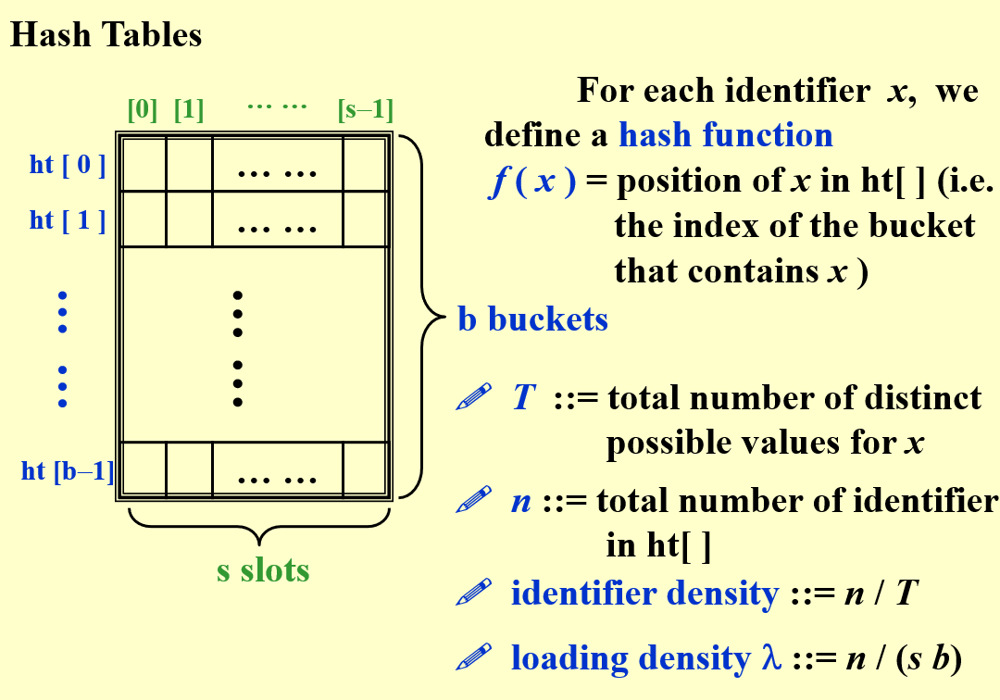
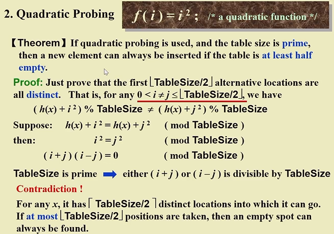

# Interpolation Search

Find **Key** from a sorted list 

$$
\frac{f[u].key-f[l].key}{n}=\frac{key-f[l].key}{i-l}\quad \rightarrow i=l+\frac{(key-f[l].key)*n}{f[u].key-f[l].key}
$$

- 如果是凹函数，i 在右半部分 ， 继续找
- 如果是凸函数，i 在左半部分  ，继续找

# General Idea

- **Symbol Table (符号表)** (\=\=Dictonary) ::= {<name, attribute>}
	- name = *since*
	- attrribute = *a list of meanings*
	- 一个 name 可以对应一个 list

## Symbol Table ADT

- **Objedcts**: name-attribute pairs, names are unique
- **Operations**

## Hash Tables

- loading density 是除以表的容量
- identifier density 是除以 name 的个数

- A **collision** occurs when we hash two nonidentical identifiers into the same bucket, $f(i_1)=f(i_2), i_1\ne i_2$
- An **overflow** occurs when we hash a new identifier into a full bucket
	- without overflow $T_{search}=T_{insert}=T_{delete}=O(1)$

# Hash Function

- $f(x)$ must be *easy to compute* and *minimizes* the number of collisions
- $f(x)$ should be *unbiased*
	- 平均下来取到每一个 bucket 的概率是一样的

1. $f(x)=x\%{TableSize}$
	1. 如果 tablesize 是 10，x 结尾都是 0，就不好
	2. 所以 tablesize should be **prime** number
2. $f(x)=(\sum x[i])\%TableSize$ when x is a string
	1. 如果 x 很短， $\sum x[i]$ 相对于 tablesize 可能太小
3. $f(x)=(x[0]+x[1]*27+x[2]*27^2)\%TableSize$
	1. 事实上三个字母出现的组合数没有这么大
4. $f(x)=(\sum x[N-i-1]*32^i)\%TableSize$

- 如果字符串太长，可能要选择 unique 的一部分

# Separate Chaining

-- Keep a **list of all keys** that hash to the same value
- 将哈希表每个元素都变成一个链表的头节点

> [!attention] 
> - Separate Chaining 可以使用头插法，也就是往每个链表的头节点后插入，不需要放在链表的尾部，所以 $T_{insert}=O(1)$
> - 但是在 Find 的时候，还是需要一个一个去找，worst case $T_{find}=T_{delete}=O(N)$

## Create an empty table

## Find a key from a hash table

## Insert a key into a hash table

**Tip**: TableSize 应该和预期要存的 Key 的数量差不多

# Open Addressing

-- find **another empty cell** to solve collision (avoid pointers)

**Tip**: 一般 $\lambda < 0.5$，才能尽量避免发生冲突

## Linear Probing

-  $f(i)=i$ **LInear function**
- $p=\frac{1}{2}(1+\frac{1}{(1-\lambda)^2})$ for **insertions and unsuccessful searches**
- $p=\frac{1}{2}(1+\frac{1}{1-\lambda})$ for **successful searches**
- 尽管 $p$ 可以很小，但是可能出现 worst case 很大的情况
	- *primary clustering*

## Quadratic Probing

> [!NOTE] $Theorem$
> If quadratic probing is used, and the table size is **prime**, then a new element can always be inserted if the table is **at least half empty**. 
> - *Proof* 
> 	-  
> - *Note*
> 	- If the table size is a prime of the form $4k+3$, then the quadratic probing $f(i)=\pm i^2$, can probe the entire table.

### Find

- **Note**
	- while 里面用递增来加上每个平方数，使用*位运算*，*效率提高*
	- 使用 if 来决定是是否减，这样*比取模效率高*
	- 返回了什么？
		- 如果找到了，返回了这个元素的位置
		- 如果没找到，返回了*第一个找到的空的待插入的位置*

### Insert

- **Note**
	- 这里的  代表着  的状态
		- ，代表空
		- ，代表被占用
		- 这样方便管理

## Double Hashing

-  $f(i)=i*hash_2(x)$ 第二个哈希函数
	- easy to compute
	- $hash_2(x) \not\equiv 0$
	- 确保每个  都能探测到
	- $hash_2(x)=R-(x\%R)$ 是比较好的函数，其中 $R$ 是小于  的**质数**
- **Note**
	- 如果实现的好，那么平均的查找时间基本上等于 *random collision resolution strategy*
	- Quadratic Probing 不需要第二个哈希函数，因此*更快更简单*

## Other methods

- 布谷鸟哈希：建立两个哈希表，鸠占鹊巢
- 哈希池：如果表里发生冲突，将元素丢到池子里，池子很小，查找时间 $O(1+n)$
	- 适合冲突发生较少的情况

# Rehashing

- Build another table that is about twice as big
- Scan down the entire original hash table for non-deleted elements
- Use a new function to hash those elements into new table
- $T(N)=O(N)$
- **Question**: When to rehash?
	- As soon as the table is half full
	- When an *insertion fails*
	- When the table reaches a certain *load factor*

> [!NOTE] Note
> Usually there should have been $N/2$ insertions before rehash, so $O(N)$ rehash only adds a constant cost to each insertion. 
> However, in an interactive system, the unfortunate user whose insertion caused a rehash could see a slowdown. 
> 平均到每个用户的操作，时间复杂度只增加了常数 
> 但是如果某个用户的操作触发了 rehashing，那么他就要等很久

# HW

- The average search time of searching a hash table with N elements is **cannot be determined**
- Which of the following statements about HASH is true?
	- A. the expected number of probes for insertions is greater than that for successful searches in linear probing method **对，因为插入总要找到一个空的 slot 才停止，但搜索不需要**
	- B. if the table size is prime and the table is at least half empty, a new element can always be inserted with quadratic probing **不确定**
	- C. in separate chaining method, if duplicate elements are allowed in the list, insertions are generally quicker than deletions **这时 insert 只要插入头节点，deletion 要搜索**
	- D. all of the above
- Suppose that the numbers {4371, 1323, 6173, 4199, 4344, 9679, 1989} are hashed into a table of size 10 with the hash function h(X)=X%10, and hence have indices {1, 3, 4, 9, 5, 0, 2}. What are their indices after rehashing using h(X)=X%TableSize with linear probing? ***why*** 
	- A. 11, 3, 13, 19, 4, 0, 9
	- B. 1, 3, 4, 9, 5, 0, 2
	- C. 1, 12, 9, 13, 20, 19, 11
	- D. 1, 12, 17, 0, 13, 8, 14