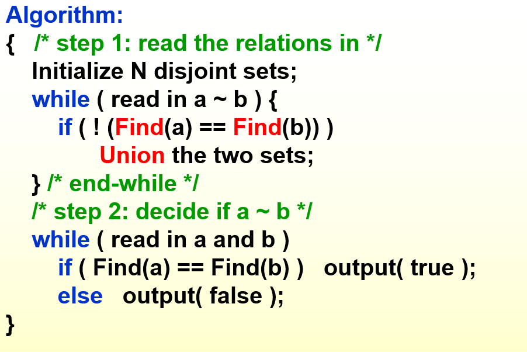
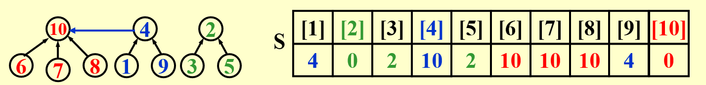
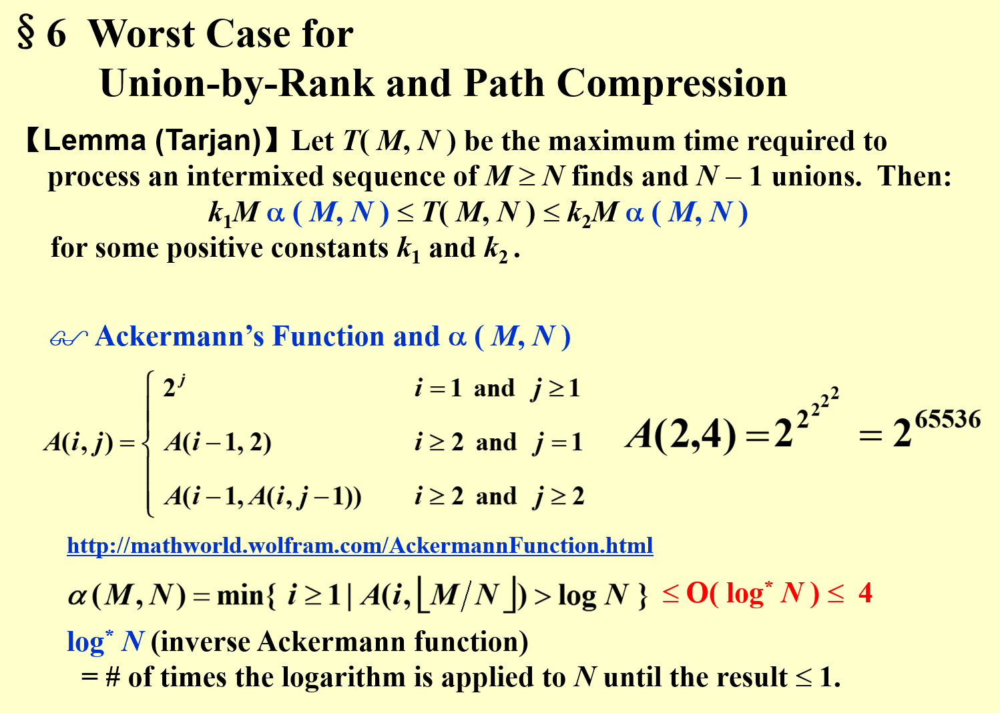
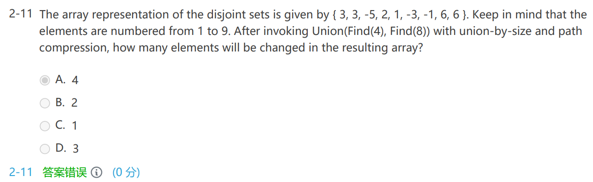

# Equivalence Relations

## Definition

- **R**: 相关关系
- **~**: 等价关系，两个元素之间的等价
- **等价类**：具有等价关系传递成的一个子集

# The Dynamic Equivalence Problem

## Linear solution

- 数组或链表都可以
- 伪代码 *union and find* 
	- 读取所有等价规则 a~b *on-line*
		- 如果 ab 不在一个 class 里
			- 合并 class
	- 解决输入的查找请求
- $O(N)$ 如果不考虑查找的时间

## Tree solution (forest)

- 构建树**指针指向根**，方便找到*组长*

# Basic Data Structure



## Union(i, j)

- **将两个等价类 $S_i, S_j$ 合并**
- 只需要将一棵树的根节点指向另一棵树的根节点即可

### Implementation 1

- 使用数组来组织森林
- 合并数组即可
- **太慢了，数组操作麻烦**

### Implementation 2

- 数组表示 `S[element] = the element's parent`，每个 index 对应的 value 是父母的值，根节点 value 为 -1
	- 事实上，对于从 1 到 N 命名的元素，元素就是下标
- 合并的时候，只需要将一个集合的根节点的值写成另一个集合的根节点

```c
void SetUnion( DisjSet S, SetType Rt1, SetType Rt2)
{
	S[Rt2] = Rt1;    // 这个元素的组长设置为Rt1
}
```

## Find(i)

- `Find(i)`，找到元素 i 所在的等价类

### Implementation 1

- 顺着树找到根节点，根节点找到 S 下标

### Implementation 2

```c
int Find( int i , DisjSet S)
{
	while(S[i] != 0) i = S[i];
	return i;
}
```

# Analysis

## 比较难分析时间复杂度

## Worst case

1=2 2=3 3=4 4=5......

- 每一次都要 find(1)
- 构成了一个 *skewed tree*
- $\Theta(N^2)$

# Smart Union Algorithms

## Union by size - Always change the smaller tree

- 如何标记一个树的大小？`S[Root] = -size`
- Let T be a tree created by union-by-size with N nodes, then
	- $height(T) \le \lfloor \log_2N\rfloor +1$
	- proof: Each element can have its set name changed at most $\log_2N$ times
- $O(N+M\log_2N)$
	- N 个 union
	- M 次查找

## Union by height

- 总是把矮的树指向高的树
- 同样使用 `S[Root] = -height` 来表示高度

# Path Compression 路径压缩


- 所有的 member 都直接和组长联系，只有两层
- 在查找的同时指向 root  

```c
SetType Find (int X, int* S)
{
	if(S[X] <= 0) return X;  // this is root
	else return S[X] = Find(S[X], S);  // function "Find" will return the root, and set the parent of this element directly to root
}
```

- **Path compression 和 union-by-height 不可以同时使用**
- 如果 find 多的话，就可以使用 path compression，减少之后的 find 的时间复杂度

# Worst case for Union-by-Rank and Path Compression

## Lemma(Tarjan)

- M find, N-1 unions
- $k_1M\alpha(M,N)\le T(M,N) \le k_2M\alpha (M,N)$
- $\alpha$ 和阿克曼函数
	- 阿克曼函数的增长速度很快
	- $\alpha(M,N) = min\{i\ge1|A(i,\lfloor M/N\rfloor)>\log N\}\le O(\log^*N)\le 4$
	- $\log^*N$ = # of timse the logarithm is applied to N until the result $\le 1$



# Exercises

## HW 7

- Let T be a tree created by union-by-size with N nodes, then the height of T can be .
	- $\le \log_2N+1$
	- 不会推，**记忆**

## Midterm

- If a tree is created by union-by-size with n nodes, then each element can have its set name changed at most $\log n$ times. **T**
	- 这里没有底数也认为是正确的，不是很理解

### Review

- 
	- 注意 path compression 是在 find 函数中执行的，一个 find 会将本次路径上的所有点都直接指向组长