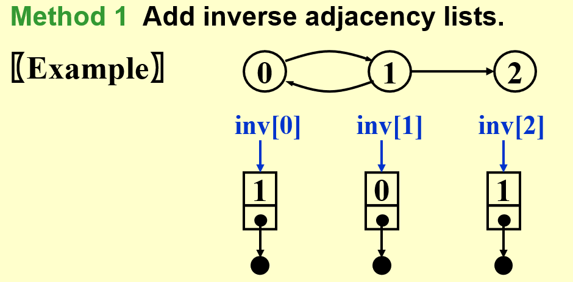
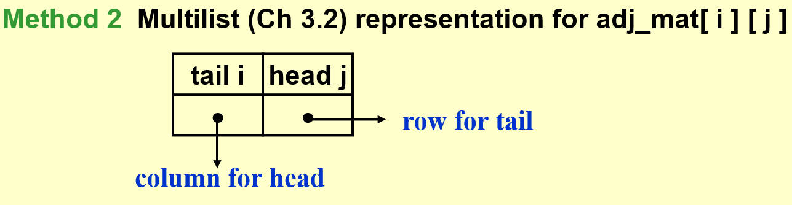
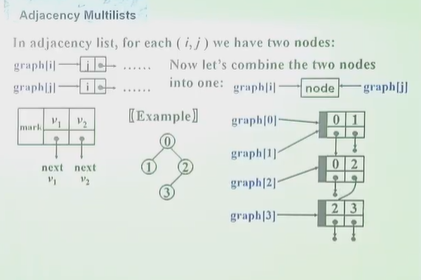
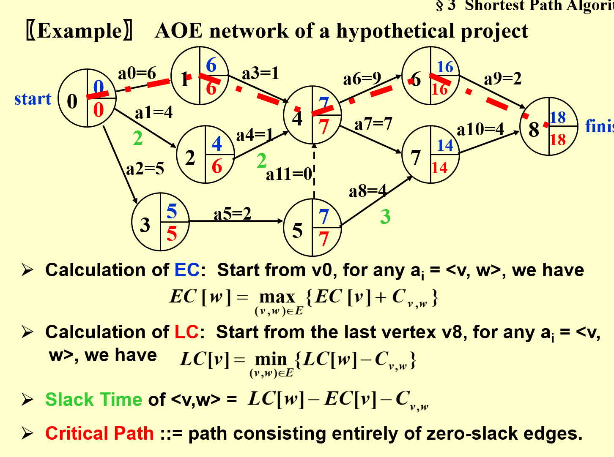
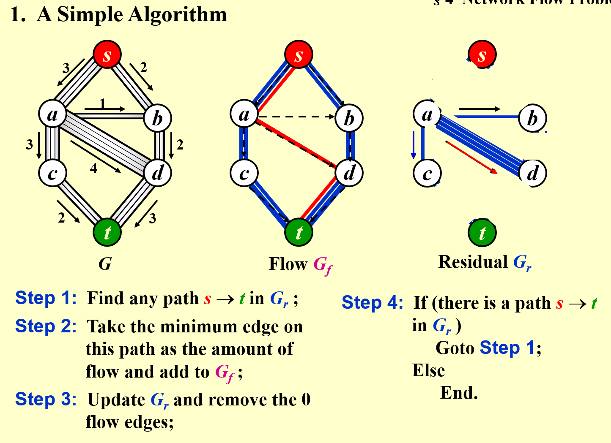
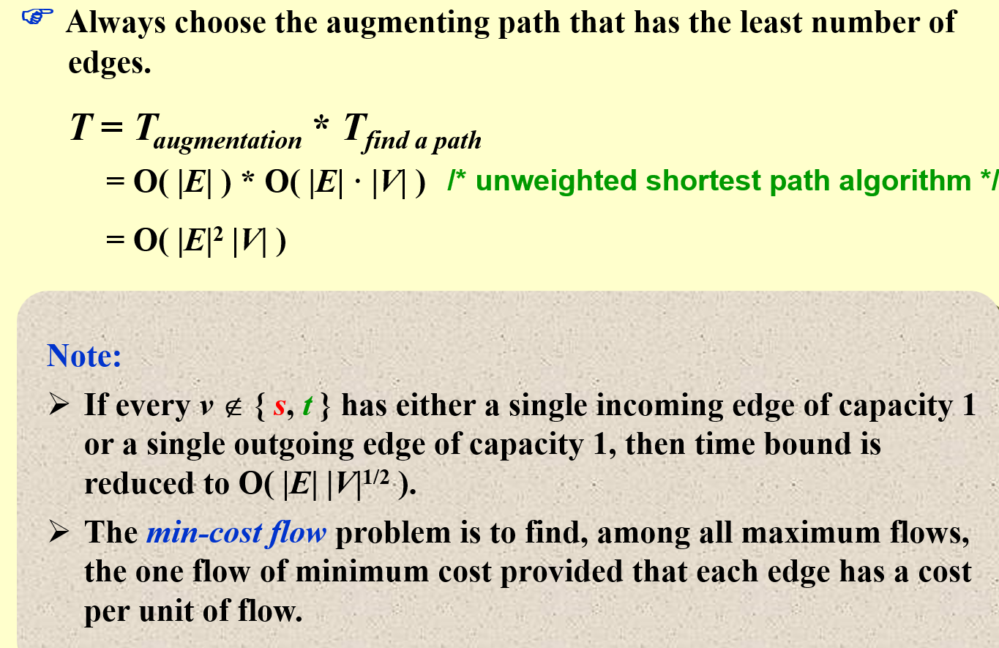
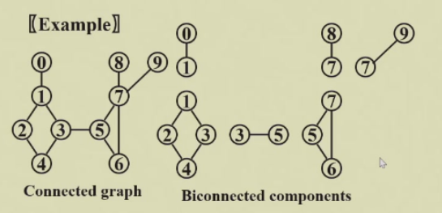
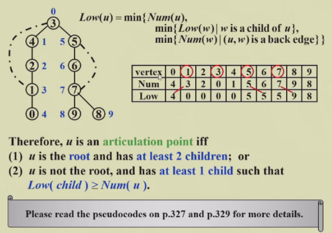

# 1 Definitions

- $G(V,E)$ 
	- G: graph
	- V: Vertex
	- E: Edge
- Direction 有向图(digraph)或无向图
	- 有向图 head->tail
- Restrictions
	- Selfloop is illegal 不存在自环
	- Multigraph is not considered 不存在重合的边
- **Complete graph**：完全图，所有点之间都有边
	- 有向或无向不同，有向是两倍
- **adjacent**
	- digraph 有 adjacent *to/from*
		- v_i -> v_j
		- v_i is adjacent *to* v_j, to 就是向右的箭头
		- v_j is adjacent *from* v_i, from 就是向左的箭头
- **Subgraph**
	- 顶点和边都是子集
- **Path**
	- $v_p$ 到 $v_q$ 的一系列边
	- Length of path: number of edges on the path
	- **Simple path**: 经过的节点不重复
	- **Cycle**: $v_p=v_q$ 的 simple path，绕一圈
	- **Connectness**: $v_p$ 和 $v_q$ 之间存在路径
	- **Connected graph**: 任意顶点之间连通
		- 对于无向图，只要*只有一个 component*，那么就连通
		- 或表述为，只要*每两个不同的顶点之间是连通的*
- **Component of an undirected G**: 最大的连通子图
- **Tree**: 连通的没有环的图 *a graph that is connected and* **acyclic**
- **DAG**: 有向无环图
	- 有先后顺序的神经网络算法
- **Strongly Connected DG**: 强连通有向图
	- 任意两个顶点之间都有一条有向路径
	- **Weakly Connected DAG**: 不是强连通（不全有有向路径），但是存在无向路径
	- **Strongly connected component**: 最大强连通子图
- **Degree(v)**: 一个顶点，存在 **Indegree** and **Outdegree**
	- **degree = indegree + outdegree**
	- $e = \sum d_i / 2$

## Representation of Graphs

### Adjacency Matrix 邻接矩阵

-  
	- UDG: symmetric	
		- array: $adj\_mat[n(n+1)/2]=\{a_{11}, a_{12}, \dots , a_{1n}, a_{22}, \dots ,a_{2n}, \dots, a_{nn}\}$
	- DG: all needed
		- array: ...
	- degree
		- UDG:  $degree(i)=\sum_{j=0}^{n-1}adj\_mat[i][j]=\sum_{j=0}^{n-1}adj\_mat[j][i]$
		- DG: $degree(i)=\sum_{j=0}^{n-1}adj\_mat[i][j]+\sum_{j=0}^{n-1}adj\_mat[j][i]$
	- con
		- 存储开销 $O(N^2)$，特别是对于 *skewed graph*
		- 判别是否连通，时间复杂度 $O(N^w)$

### Adjacency Lists: Replace each row by a linked list

- 对于每个 node，构建一个 linear list，里面放本节点的 adjacents
	- order does not matter
- Space complexity
	- n nodes, e edges
	- UDG: $S = (n+2e)(ptrs)+2e(ints)$
	- DG: $S=(n+e)(ptrs)+e(ints)$
- Degree(i) 就是对应 list 的长度
- $T(N)=O(n+e)$

#### Inverse adjacency lists

- 构建 **inverse adjacency list** 表示哪些节点指向了本节点

#### Multilist representation for 

> [!hint]- 回忆 [Ch.03 List](Ch.03 List.md)
> ### Multilists
> 
> For example, represent the relationship between students and the courses. **Array would be too complex in space**
> 
> 
> 
> - 每个节点表示一个 pair relationship，节点内要存储学生编号和课程编号

- 每个节点有 

### Adjacency Multilists

- 使用 node 表示一条边
- $\{mark, v_1, v_2\}$
- 构造方法
	- 遍历所有 nodes 
		- 对于一个节点，找到第一个被引用的边 ，从节点指向这个边
	- 将边从前往后进行指向被引用的位置

- **缺点？**
	- 构造麻烦
	- 存储开销一样，不算 mark 都有 $(n+2e)(ptrs)+2e(ints)$
- **优势**
	- mark 标记节点的 weight
	- mark 也可以表示边是否被 visit

### Weighted Edges

- 
	- 用的更多，因为有稀疏优化，实际使用矩阵多 *tensor*
-  add a weight

# 2 Topological Sort 拓扑排序

- Example: 学习课程的先修限制 *prerequisites*
	- 课程为结点，DG

## AOV Network (Activities on vertex)

- **predecessor**
	- *immediate & indirect*
- **successor**
- **Partial order** 偏序
	- 先修关系可以传递，不可自反 *transitive but irreflexive*
- **AOV must be a DAG** no cycle

## Definition

- 如果 i 为 j 的 predecessor，则 i 出现在 j 前面
- 每次选择没有 predecessor，即没有 indegree 的节点，并将它的后继的 indegree 减一（删去这个节点）
- 可能不是唯一的 *not unique*

## Solution

### Solution 1

- 使用一个 Counter 表示 visit 的节点数

- Time complexity $O(|V|^2)$
- **Improvement**
	- 解决 findnewdegreezero 太慢了，可以每次找到就放在一个 queue or stack 中，直接取就行，直到队列为空

### Solution 2

- Time Complexity: $O(|V|+|E|)$
	- worst case: 退化成 $O(|V|^2)$

> [!hint] Uniqueness of Topological Sequence
> 如果 DAG 中任意两个顶点之间都存在一条*有向路径*，A 到 B 或者 B 到 A，那么一定是唯一的

# 3 Shortest Path Algorithms

- cost function $c(e)$ for $e\in E(G)$, describing **weighted path length**

## Single-Source Shortest-Path Problem

- 对于图中给定的一个点，找到到其他所有点的最短路径
- *Negative Cost* 过于复杂，可能导致无解，暂时不考虑

### Unweighted Shortest Paths

#### idea

- 从起点出发，找到能到达的节点，就是距离为 1 的节点，visit
	- Tree: Level-Order Traversal
	- **Breadth-first search(BFS)** 广度搜索

#### Implementation

- 
- 
-  指向上一个顶点的指针，可以逆向找出路径

##### imp 1

- worst case, linear graph
- $T=O(|V|^2)$

##### imp 2

- 所有顶点都进行的 queue 操作
- 所有的边都走了一遍 
- $T=O(|V|+|E|)$

### Dijkstra's Algorithm(for weighted shortest paths)

- 使用集合 S 表示所有已经找到了最短路径的 vertex 的集合
- 对于不在 S 内的 vertex，定义距离为 S 中的 vertex 到它距离的最小值
- If the paths are generated in *non-decreasing order*, then
	- the shortest path must go through **ONLY** $v_i\in S$
	- 每次找到 S 距离最小的顶点，放入 S *Greedy Method*
	- 如果 ，把  放入 S，随后的  可能会变

#### Implementation 1 直接遍历 ==Good if the graph is dense==

- V = smallest unknown distance vertex, *traverse the table $O(|V|)$*
- $T=O(|V|^2+|E|)$ **Good if the greph is dense**

#### Implementation 2 Minheap ==Good if the graph is sparse==

- V = smallest unknown distance vertex
	- **Keep distances in a priority queue and call DeleteMin $O(\log |V|)$**
- 
	- Method 1: DecreaseKey $O(\log |V|)$
		- $T=O(|V|\log|V|+|E|\log|V|)=O(|E|\log|V|)$
	- Method 2: insert W with updated Dist into the priority queue
		- $T=O(|E|\log |V|)$
		- **But require |E| DeleteMin with |E| space**

#### Other improvements: Pairing heap (Ch.12) and Fibonacci heap (Ch.11)

### Graphs with Negative Edge Costs

-  $T=O(|V|*|E|)$
- 可以设置一个 ，如果一条边已经遍历超过这么多次，那么就认为是死循环，程序退出

### Acyclic Graphs *无环图*

-  回忆 [2 Topological Sort 拓扑排序](#2-topological-sort-拓扑排序) 里的无环图，AOV Network，$T=O(|E|+|V|)$

#### Application: AOE(Activity On Edge) Networks

- edge: **activity**
	- weight: 任务持续的时间
	- *dummy edge*: 任务存在先后关系，一个由另一个决定
- vertex: status
	- index of vertex
	- EC: earlist completion time for this node
	- LC: latest completion time for this node
- **CPM**: Critical Path Method

- **EC**：从起点开始往后计算，每次加上边，每个节点要取入度中最大的
- **LC**：从终点往前计算，每次减去边，每个节点要取出度中最小的
- **Slack Time**：*松弛时间*，这条边上完成任务之余可以 idle 的时间
- **Critical Path**：所有的 *slack time* 都是 0，*必须盯牢的任务线*

## All-Pairs Shortest Path Problem

For all pairs of $v_i$ and $v_j$ $(i\ne j)$ , find the shortest path between.

### Method 1 Use **single-source algorithm** for |V| times

- $T=O(|V|^3)$
- ==works fast on sparse graph==

### Method 2 *in Ch.10*

- ==works faster on dense graphs==

# 4 Network Flow Problems 网络流问题

- 每条边都存在最大流量限制，**有向图**
- 从 source 到 sind 的最大流量问题

## A Simple Algorithm

- 根据原始的 graph，创建两个 graph
	- Flow network $G_f$
	- Residual network $G_r$ *残差网络*
1. Find any path from **s** to **v** in $G_r$, called **Augmenting path**
2. Take the minimum edge on this path as the amount of flow and add to $G_f$ 找到瓶颈，在 flow 里整条路线上更新到这个流量
3. 并更新 residual
4. 如果 residual 中仍然存在 path，继续 step 1；否则结束

### 问题 1

- 如果使用 greedy method，可能提前导致路封死

## A Solution - allow the algorithm to *undo* its decision

- 更新 residual 时，加上反向的路径，有一个改错的机会
- **Proposition**: 如果边是**有理数**，一定会找到最大的流量
- **Note**: The algorithm works for G with *cycles* as well
- 

## Analysis ( If the capacities are all integers )

- An augmenting path can be found by an unweighied shortest path algorithm
	- $T=O(f*|E|)$, **f** is the maximum flow
- Always choose the augmenting path that allows the largest increase in flow *modify Dijkstra's algorithm*
	- $$T=T_{augmentation}*T_{find\space a\space path}=O(|E|\log cap_{max})*O(|E|\log |V|)=O(|E|^2\log |V|)$$
	- if cap_max *the maximum of capacity* is a small integer
- Always choose the augmenting path that has the least number of edges
	- $$T=T_{augmentation}*T_{find\,a\,path}=O(|E|)*O(|E|*|V|)=O(|E|^2|V|)$$ 
	- Note

# 5 Minimum Spanning Tree

**Definition**: A spanning tree of graph G is a tree which consists of **V(G)** and a **subset of E(G)**

- **acyclic**: the number of edges is |V|-1
- **minimun**: for the total cost of edges is minimized 所有的权重和最小
- **spanning**: it covers every vertex
- A minimum spanning tree exists iff G is **connected**
- Adding a non-tree edge to a spanning tree, we obtain a **cycle**

## Greedy Method

1. 只使用 graph 里有的边
2. 一定恰好使用 |V|-1 条边
3. 使用的边不能形成循环

### Prim's Algorithm - grow a tree

- Similiar to Dijkstra
- 每次选最小距离的

### Kruskal's Algorithm - maintain a forest

- 每次找距离最小的边
- 如果不形成 cycle，那么将树连接，删除这条边
- 如果形成 cycle，那么放弃这条边

> [!note] Time Complexity
> - 初始化一个空的边集 $O(1)$
> - 对边的权重进行排序 $O(|E|\log |E|)$
> - 按照边的权重从小到大，进行并查集操作 $O(|E|\log |V|)$
> 	- 如果采用 union-by-rank and path-compression，并查集能优化成 $O(|E|\alpha(|E|, |V|))$
> 	- 这里的 $\alpha$ 是反阿克曼函数，接近于常数
> - 所以，总体的时间复杂度为 $O(|E|\log |E|)$

# 6 Applications of Depth-First Search

*a generalization of preorder traversal*

- $T=O(|E|+|V|)$
- BFS: 每次找一层*队列，while 循环* **VS** DFS: 每次先找到所有的*递归*

## Undirected Graphs

- DFS 能够访问的所有节点，**构成一个 component**

## Biconnectivity

- **Articulation Point**: v is an articulation point if G' = deleteVertex(G, v) has **at least 2** connected components *如果把这个节点删掉之后，图被分开了*
- **Biconnected graph**: G is a biconnected graph if G is **connected** and **has no articulation points**
- A **biconnected component** is a *maximal biconnected subgraph*

### Finding the biconnected components

#### 1. Use DFS to obtain a spanning tree of G

- spanning tree 重新按照 visit 顺序编号，**得到 DFS number**
- **Back edges** 图中有但树中没有的边
- **Note**: if u is an ancestor of  v, then Num(u)<Num(v)

#### 2. Find the *articulation points* in G

- The *root* is an articulation point iff it has **at least 2 children**
- Any *other vertex* is an articulation point iff u has **at least 1 child**, ==and== it is impossible to **move down at least 1 step and then jump up to u's ancestor**
	- 至少有一个孩子，而且无法从后代中通过 *back edge* 回到祖先
	- 

#### 3. $Low(u)=min\{Num(u),min\{Low(w)|w\,is\,a\,child\,of\,u\},min\{Num(w)|(u,w)is\,a\,back\,edge\}\}$ 

- 是 **自己的 number**、**children 中最小的 low number**、**自己 backedge 另一头中最小的 number** 中最小的
- 计算 Low number
	- 
	1. **根节点** 的 low number 是 0
	2. 先找所有 **backedge** 影响的 low number *因为 backedge 要找的是另一头的 number， 已经全部已知*
	3. **DFS**，每次返回本节点的 low number，每次比较自己的 number 和所有返回值，取最小的

%%**Pseudo-code on p.327 and p.329**%%

#### 4. Therefore, u is an articulation point iff

- u is the **root** and has **at least 2 children**; or
- u is not the root, and has **at least 1 child** such that $Low(child)\ge Num(u)$

## Euler Circuits

- **Euler tour**: draw each line exactly once without lifting your pen from the paper *一笔画*
- **Euler curcuit**: draw each line exactly once without lifting your pen from the paper, **AND** finish at the startgin point
- Propositions
	- An Euler circuit is possible ==iff== the graph is connected and each vertex has an **even** degree.
	- An Euler tour is possible ==if== there are exactly **two** vertices having **odd** degree. One must start at one of the odd-degree vertices.

### algorithm

- the path should be maintained as a linked list
- for each adjacency list, maintain a pointer to the last edge scanned
- $T=O(|E|+|V|)$
- Other algorithm: *Hamilton Cycle*

# HW

## HW 8

1. If a directed graph G=(V, E) is weakly connected, then there must be at least |V| edges in G. **F**
	1. weak / strong connection
		1. 弱连接指的是存在一条路径，经过两点
		2. 强连接指的是，从 A 出发可以到 B，从 B 出发也可以到 A
	2. 应该是 |V|-1，只要有 undirected path 就行
2. Given the adjacency list of a directed graph as shown by the figure. There is(are) __ strongly connected component(s).
	1. 注意单个 vertex 也算是子图
	2. 首先看哪些节点没有入或者没有出的，一定是单节点的子图

### 函数题：Is Topological Order

#### idea 1

- 遍历，建立  保存入度，**记得初始化为**
- 遍历输入，对于每个输入，如果对应  是 0，则正确
	- 并将 successor 的入度减一
- 如果入度还不是 0 的节点被 visit，则不正确，退出 false

##### test

- 错误了，因为**AdjV 里的节点编号也是从 0 开始的**
- 修改之后就正确了

### 编程题：Hamiltonian Cycle

#### idea 1

- 建立图，adjmat/adjlist?
	- 边界为 200 vertices，40000 个 int，预计占用 2^18 byte，空间足够，使用完全 adjmat
- 对于每一个输入 query
	- 首先数量需要是 Nv+1 以上
	- 然后首尾相同
	- 其次需要包含所有数字
	- 再次检查是否都可以连通

> [!attention] 关于循环控制语句
> C 语言中没有能够直接  或者  上层循环的用法，需要用一个  来传递循环控制操作！

## HW 9

- In a weighted undirected graph, if the length of the shortest path from  to  is 12, and there exists an edge of weight 2 between  and , then the length of the shortest path from  to  must be no less than 10.
	- **T**
	- 如果 less than 10 的话， to  的最短就比 12 还小了

## HW 10

### 7-1 Universal Travel Sites

- **就是最大网络流问题**，但是加上了字符串，最好有字典，或者使用 python
- 思路
	- 读图
		- 边里直接存节点名称，全部使用 strcmp，可以避免字典，*这里用 python 来实现*
		- 每个边同时存储 $G_r, G_f$
	- unweighted 路径搜索，返回路径 *直到搜不到 break*
	- 根据路径更新 $G_r, G_f$

**总之，灵活切换 python 来实现是正确的选择**

### Uniqueness of MST

- 具有相同**拓扑结构**的 MST 就是相同的
	- 任何一棵树都可以 **reroot**，但是**边集不变**
	- 只要**边集相同**，就认为 MST 相同

> [!NOTE] 如果能够建立最小生成树，如何判断是否唯一？
> 如果出现了相同权重的

#### idea

- 对 edge 按照 weight 升序排列
- 使用并查集，路径压缩，遍历 edge
	- 对于路径长度 d
		- 首先对所有的长度为 d 的路径进行分析，是否能够加入图中 *是否成环*，并进行记录
		- 然后进行逐个加入
- 最后看看**如果存在可能加入 MST 但是实际上没有加入**的路径，那么 MST 不唯一

##### 注意

- 需要使用快速排序，不然超时
- 实现过于麻烦

## HW 11

- Apply DFS to a directed acyclic graph, and output the vertex before the end of each recursion. The output sequence will be: **reversely topologically sorted**
	- 因为是在返回的时候打印的，而 DFS 的顺序是顺着拓扑排序深入的
	- *注意* 有向无环图就是树，这就是树的 DFS
- Use simple insertion sort to sort 10 numbers from non-decreasing to non-increasing, the possible numbers of comparisons and movements are:
	- 一共有 45 个逆序对，所以交换的次数不会大于 45
	- 选 D. 45, 44

### 函数题：Strongly Connected Components

- 注意不是连通是 **digraph 强连通**，所以不是简单的 [Undirected Graphs](#undirected-graphs)

#### Idea

> [!hint] 如何找到某个顶点所在的 SCC ?
> - 首先，一个 SCC 的定义是，内部所有两个顶点之间都存在双向路径
> 	- 那么 V 可以找到其他所有节点，其他所有节点也可以找到 V
> 	- 满足上面这个条件，其他节点**就可以相互找到**，*使用 V 作为跳板*
> - 所以得到了 SCC 的 **充要条件**

- for all V in G
	- if not visited
		- find the SCC it is in 
		- print(\n)
- 
	- V 出发能找到的节点构成集合 From
	- 能找到 V 的节点构成集合 To
	- 取交集，加上 V 本身，就是 V 所在的最大 SCC
- **使用  利用 Warshall 算法可以更加方便地解决**
	- 对于  使用 Warshall 算法，得到目标矩阵
	- 对于每个 unvisited 的顶点 V
		- **取矩阵里第 V 行和第 V 列的 AND**
			- 这个结果就是 V 所在的 SCC
		- visit SCC 内所有的顶点 *打印，标记*