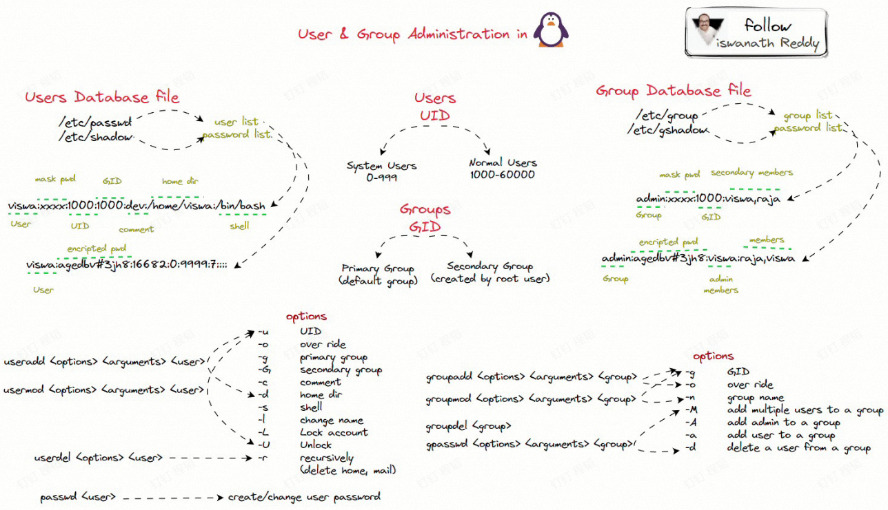
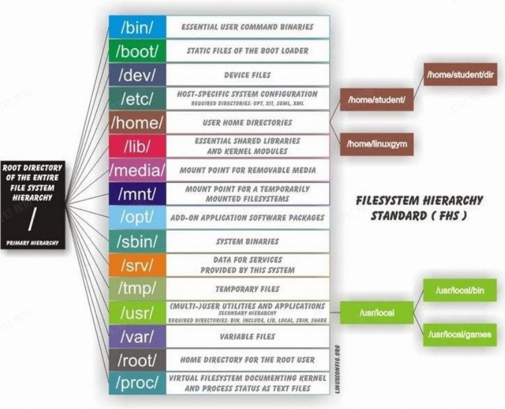
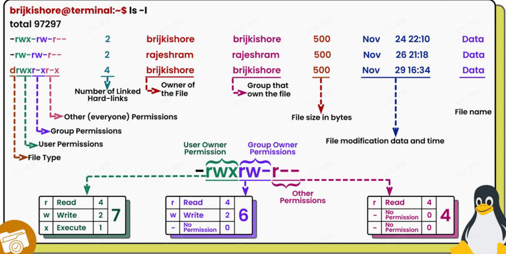
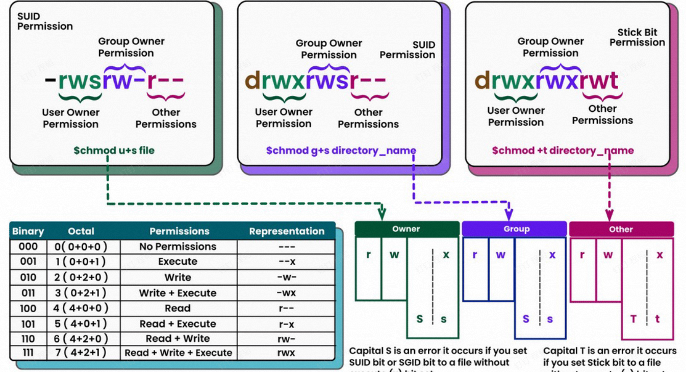
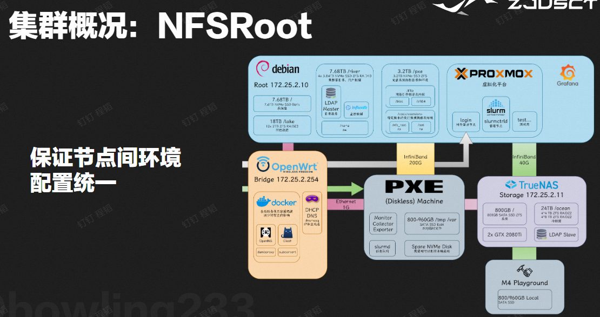

# 集群相关

## 登录节点

直接使用学号登录集群，下面登录  节点：

> [!attention]
> 可以使用 VSCode 远程，但退出前需要用  杀掉 VSCode Server。

## 使用集群代理

- proxychains 4
	- hooks network-related libc functions
	- redirects the connections through SOCKS 4 a/5 or HTTP proxies
	- supports TCP only (no UDP/ICMP etc)
	- quiet mode: -q

# Linux 实践

## 获取帮助

## Linux 用户和用户组

> [!NOTE] by ChatGPT
> - 用户（User）
> 	- **定义**：用户是一个能够登录到系统的实体，可以是一个人、一个服务、或者一个进程。
> 	- **用户标识符 (UID)**：每个用户在系统中都有一个唯一的用户标识符。
> 	- **用户文件**：用户信息通常存储在  文件中，包括用户名、用户ID (UID)、主目录、登录 shell 等。
> 	- **家目录**：每个用户通常有自己的家目录，用于存储个人文件和设置。
> - 用户组（Group）
> 	- **定义**：用户组是一个用户集合，用于简化和管理对文件和目录的访问权限。
> 	- **组标识符 (GID)**：每个组在系统中都有一个唯一的组标识符。
> 	- **组文件**：组信息通常存储在  文件中，包括组名、组ID (GID) 和组成员。
> 	- **主要组和附加组**：每个用户有一个主要组（在用户信息中定义），还可以属于一个或多个附加组。
> - 权限管理
> 	- **文件权限**：Linux 使用用户和组来管理文件和目录的访问权限，每个文件或目录都有所有者（用户）、所属组以及其他用户的权限设置。
> 	- **三种权限**：读 (r)、写 (w)、执行 (x)。

> [!note] 
> 集群使用去中心化的用户认证：NIS, LDAP

### root

> [!attention]
> - 不要滥用 root 账户，可能会让某些安全系统失效
> -  不是万能的，多 RTFM

## Linux 一切皆文件

### Linux 的文件系统层次

### Linux 文件权限

## Linux 命令大杂烩

## Linux 内核知识

- *内核：实现用户空间和物理硬件的交互*
- Why?
	- 危险指令只有 os 才能执行
	- 提高稳定性
- 用户态下执行命令受到诸多检查
- 需要访问系统资源时，执行系统调用，切换到内核态
- 宏内核与微内核
- 驱动是一种内核模块

### 使用内核模块

# HPC 中的软件

## 集群管理

- RAM Disk 和镜像部署
- NFS 挂载家目录和软件

## 环境管理

- Lmod
- 包管理器 Spack
- Conda
- 参考使用文档

## nvcc 命令

