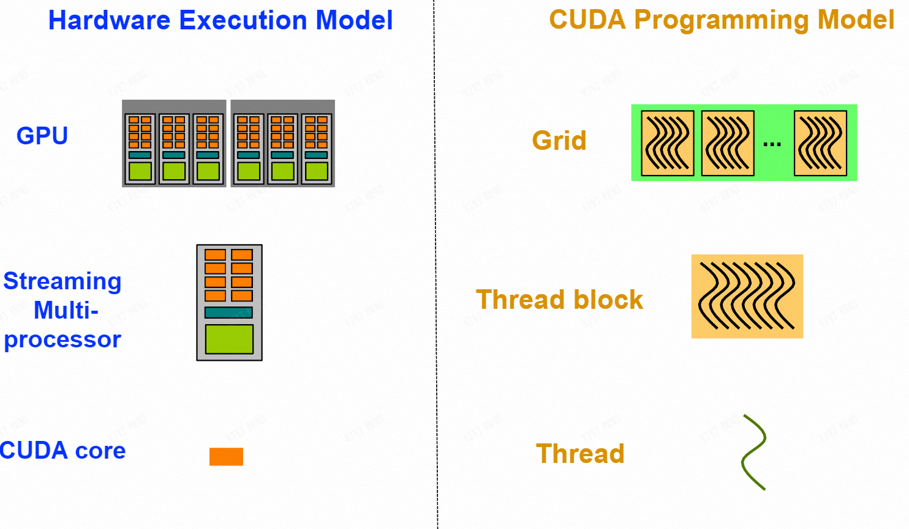
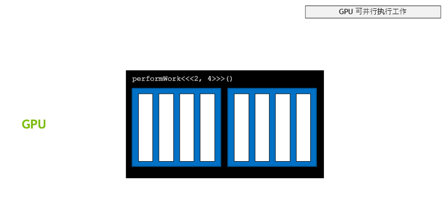
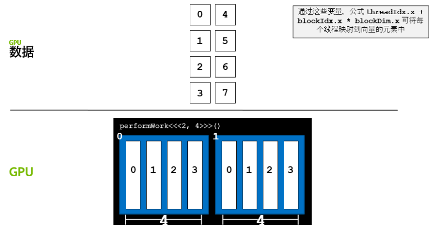
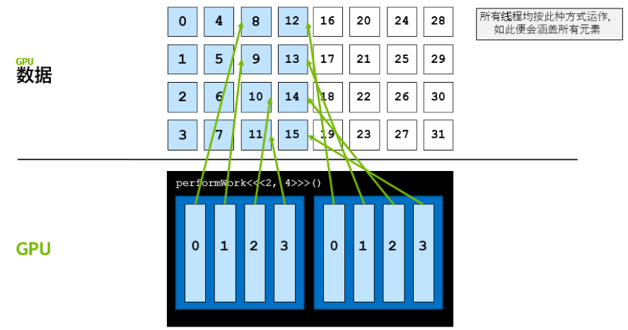
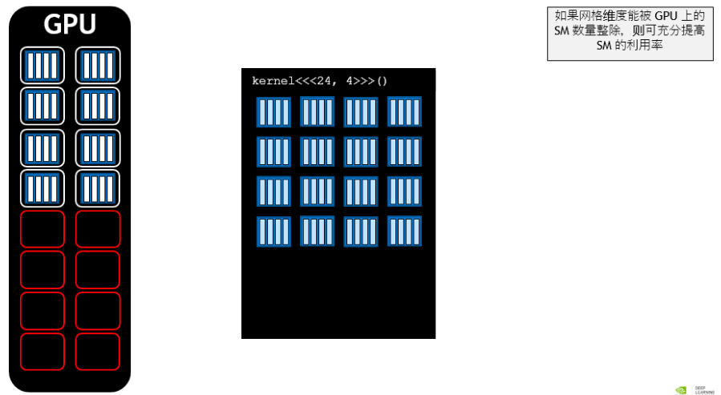
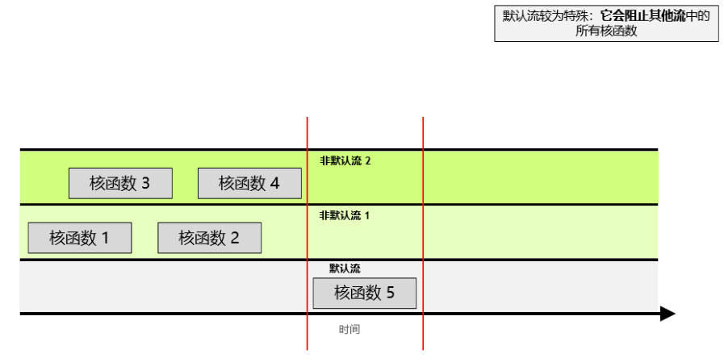

# Part 1. Graphics Processing Units

## Roadmap

- ^ Many-core (GPU)
- ^ Inter-core Parallelism
- ^ Parallelism
- ^ Pipeline CPU
- ^ Multi-Cycle CPU
- ^ Single-Cycle CPU
- ^ Von Newmann Architecture

### Von Newmann Model

- Stored program
	- 指令和数据存储在统一的内存中
- Sequential instruction processing
	- 单线程
	- Program counter (instruction pointer) 决定了当前执行的指令

### Single-Cycle Microarchitecture

-  AS := Architectural state at the beginning of a clock cycle
- AS' := ~ at the end fo a clock cycle

### Multi-Cycle Microarchitecture

- Idea
	- 缩短周期
	- 每条指令执行多个周期
- ISA 决定了次态，对于 ISA 来说，没有中间状态
- 微架构实现了状态转换
	- single-cycle: AS --> AS'
	- multi-cycle: AS --> AS+MS1 --> AS+MS2 --> AS'

### Pipeline CPU

- Key idea: **process other instructions on idle resources**
- 将每个指令分成多个 stage，每个阶段执行不同的指令

## Why GPU?

### Programming Model: CPU and GPU

### Programming Model vs. Hardware Execution Model

- Programming Model: threads
	- sequential, SIMD, dataflow, MIMD, SPMD
- Hardware Execution Model: cores
	- out-of-order execution, vector processor, array processor, dataflow processor, multithreaded processor

### A GPU is a SIMD (SIMT) Machine

- Except it is not programmed using SIMD instructions
- It is *programmed using threads* (SPMD programming model) 
	- 每个线程对不同的数据执行相同的操作
	- 每个线程可以被独立执行控制

## Programming Model

### SISD vs. SIMD vs. SPMD

#### Sequential SISD

#### Data Parallel SIMD

#### Multithreaded SPMD (Single Program Multiple Data)

- Each iteration is independent
- 每个迭代（循环）都生成一个线程，每个线程都做相同的操作

## GPU Programming Example

### CUDA/OpenCL Programming Model

- SPMD, e.g. CUDA
- Hardware
	- Thread Grid: the whole set of threads
	- Thread Block
		- 是一种编程抽象，表示一组可以并行执行的线程
		- 一个 block 中共享内存，且时序同步
	- Thread: corresponds to an iteration

### CUDA Programming Language

#### CUDA example: vector addition

##### Kernel code

#### CUDA example: matrix multiplication

## SIMT (Hardware) & Warp (Software)

- SIMT: Single Instruction Multiple Thread
	- 16 CUDA cores in a SM are executed in a lock step
- Warp:
	- A warp, a basic execution unit, consists of 32 consecutive threads
	- A thread block is divided into warps for SIMT execution

# Part 2. CUDA C 编程基础

## 使用 CUDA C/C++ 加速应用程序

### Intro

获取系统中可用的 GPU 资源：

一个加速程序  样例：

> [!NOTE]- 加速计算中的一些术语
> 
> 
> -  关键字表明以下函数将在 GPU 上运行并可**全局**调用，而在此种情况下，则指由 CPU 或 GPU 调用。
> - 通常，我们将在 CPU 上执行的代码称为**主机**代码，而将在 GPU 上运行的代码称为**设备**代码。
> - 注意返回类型为 。使用  关键字定义的函数需要返回  类型。
> 
> 
> 
> - 通常，当调用要在 GPU 上运行的函数时，我们将此种函数称为**已启动**的**核函数**。
> - 启动核函数时，我们必须提供**执行配置**，即在向核函数传递任何预期参数之前使用  语法完成的配置。
> - 在宏观层面，程序员可通过执行配置为核函数启动指定**线程层次结构**，从而定义线程组（称为**线程块**）的数量，以及要在每个线程块中执行的**线程**数量。稍后将在本实验深入探讨执行配置，但现在请注意正在使用包含  线程（第二个配置参数）的  线程块（第一个执行配置参数）启动核函数。
> 
> 
> 
> - 与许多 C/C++ 代码不同，核函数启动方式为**异步**：CPU 代码将继续执行_而无需等待核函数完成启动_。
> - 调用 CUDA 运行时提供的函数  将导致主机 (CPU) 代码暂作等待，直至设备 (GPU) 代码执行完成，才能在 CPU 上恢复执行。

编译命令：

### CUDA 的线程层次结构

- Grid：核函数（GPU函数）启动关联的块
- Block：线程块
- Thread：线程，每个网格中有相同的线程数

> [!NOTE] 启动并行运行的核函数
> 程序员可通过执行配置指定有关如何启动核函数以在多个 GPU **线程**中并行运行的详细信息。更准确地说，程序员可通过执行配置指定线程组（称为**线程块**或简称为**块**）数量以及其希望每个线程块所包含的线程数量。执行配置的语法如下：
> 
> 
> 
> **启动核函数时，核函数代码由每个已配置的线程块中的每个线程执行**。
> 
> 因此，如果假设已定义一个名为  的核函数，则下列情况为真：
> 
> -  配置为在具有单线程的单个线程块中运行后，将只运行一次。
> -  配置为在具有 10 线程的单个线程块中运行后，将运行 10 次。
> -  配置为在 10 个线程块（每个均具有单线程）中运行后，将运行 10 次。
> -  配置为在 10 个线程块（每个均具有 10 线程）中运行后，将运行 100 次。

> [!NOTE] 线程和块的索引
> 每个线程在其线程块内部均会被分配一个索引，从  开始。此外，每个线程块也会被分配一个索引，并从  开始。正如线程组成线程块，线程块又会组成**网格**，而网格是 CUDA 线程层次结构中级别最高的实体。简言之，CUDA 核函数在由一个或多个线程块组成的网格中执行，且每个线程块中均包含相同数量的一个或多个线程。
> 
> CUDA 核函数可以访问能够识别如下两种索引的特殊变量：正在执行核函数的线程（位于线程块内）索引和线程所在的线程块（位于网格内）索引。这两种变量分别为  和 。

> [!code] 练习：线程和块的索引
> 

### 加速 for 循环

#### 单个 for 循环的加速

> [!code] 练习：使用单个线程加速 for 循环
> 

> [!attention] 顺序问题
> 当 thread 很大时，就会发现线程的执行结束顺序是不确定的。

#### 协调并行线程

可以通过使用 CUDA 提供的索引变量进行数据的分块。

> [!NOTE] 调整线程块的大小以实现更多的并行化
> 线程块包含的线程具有数量限制：确切地说是 1024 个。为增加加速应用程序中的并行量，我们必须要能在多个线程块之间进行协调。
> 
> CUDA 核函数可以访问给出块中线程数的特殊变量：。通过将此变量与  和  变量结合使用，并借助惯用表达式  在包含多个线程的多个线程块之间组织并行执行，并行性将得以提升。以下是详细示例。
> 
> 执行配置  将启动共计拥有 100 个线程的网格，这些线程均包含在由 10 个线程组成的 10 个线程块中。因此，我们希望每个线程（ 至  之间）都能计算该线程的某个唯一索引。
> 
> - 如果线程块  等于 ，则  为 。向  添加可能的  值（ 至 ），之后便可在包含 100 个线程的网格内生成索引  至 。
> - 如果线程块  等于 ，则  为 。向  添加可能的  值（ 至 ），之后便可在包含 100 个线程的网格内生成索引  至 。
> - 如果线程块  等于 ，则  为 。向  添加可能的  值（ 至 ），之后便可在包含 100 个线程的网格内生成索引  至 。
> - 如果线程块  等于 ，则  为 。向  添加可能的  值（ 至 ），之后便可在包含 100 个线程的网格内生成索引  至 。

> [!code] 练习：加速具有多个线程块的For循环
> 

### GPU 内存分配

> [!attention] 
> GPU 无法直接访问 CPU 内存

以下是使用 CUDA 分配内存的样例：

> [!code] 练习：主机和设备上的数组操作
> 

### 解决不匹配问题

#### 如何处理块配置与所需线程数不匹配

> [!code] 练习：使用不匹配的执行配置来加速For循环
> 

#### 数据集比网格大

> [!NOTE] 使用  实现跨网格循环
> CUDA 提供一个可给出网格中线程块数的特殊变量：。然后计算网格中的总线程数，即网格中的线程块数乘以每个线程块中的线程数：。带着这样的想法来看看以下核函数中网格跨度循环的详细示例：
> 
> 

> [!code] 练习：使用跨网格循环来处理比网格更大的数组
> 

### 错误处理

> [!NOTE] 基于  类型的错误处理
> 与在任何应用程序中一样，加速 CUDA 代码中的错误处理同样至关重要。即便不是大多数，也有许多 CUDA 函数（例如，[内存管理函数](http://docs.nvidia.com/cuda/cuda-runtime-api/group__CUDART__MEMORY.html#group__CUDART__MEMORY)）会返回类型为  的值，该值可用于检查调用函数时是否发生错误。以下是对调用  函数执行错误处理的示例：
> 
> 
> 
> 启动定义为返回  的核函数后，将不会返回类型为  的值。为检查启动核函数时是否发生错误（例如，如果启动配置错误），CUDA 提供  函数，该函数会返回类型为  的值。
> 
> 
> 
> 最后，为捕捉异步错误（例如，在异步核函数执行期间），请务必检查后续同步 CUDA 运行时 API 调用所返回的状态（例如 ）；如果之前启动的其中一个核函数失败，则将返回错误。

> [!code] 练习：添加错误处理
> 
> 即进行如下步骤：
> 1. 创建  变量
> 2. 收集错误信息 
> 3. 打印错误信息 

> [!NOTE] CUDA 错误处理功能
> 创建一个包装 CUDA 函数调用的宏对于检查错误十分有用。以下是一个宏示例，您可以在余下练习中随时使用：
> 
> 

查看官方文档进一步学习：[CUDA Toolkit Documentation 12.5 (nvidia.com)](https://docs.nvidia.com/cuda/)

## 利用基本的 CUDA 内存管理技术来优化加速应用程序

### 性能分析

> [!NOTE] 使用 nsys 分析应用程序
> 将生成一个报告文件，该文件可以以多种方式使用。 我们在这里使用标志表示我们希望打印输出摘要统计信息。 输出的信息有很多，包括：
> 
> - 配置文件配置详细信息
> - 报告文件的生成详细信息
> - **CUDA API统计信息**
> - **CUDA核函数的统计信息**
> - **CUDA内存操作统计信息（时间和大小）**
> - 操作系统内核调用接口的统计信息
> 
> 在本实验中，您将主要使用上面**黑体字**的3个部分。 在下一个实验中，您将使用生成的报告文件将其提供给Nsight Systems 进行可视化分析。
> 
> 应用程序分析完毕后，请使用分析输出中显示的信息回答下列问题：
> 
> - 此应用程序中唯一调用的 CUDA 核函数的名称是什么？
> - 此核函数运行了多少次？
> - 此核函数的运行时间为多少？请记录下此时间：您将继续优化此应用程序，再和此时间做对比。
> 

> [!code] 练习：优化并分析性能
> - 即通过 nsys 输出来调节核函数的启动参数

### 流式多处理器 (Streaming Multiprocessors)

- 线程块需要映射到 SM 上，一个 SM 只能处理一个线程块
- 线程块会被发射到 SM 上，这个顺序是不确定的，所以并行执行暗示了没有顺序
- 

### 查询设备信息

> [!NOTE] 以编程方式查询GPU设备属性
> 由于 GPU 上的 SM 数量会因所用的特定 GPU 而异，因此为支持可移植性，您不得将 SM 数量硬编码到代码库中。相反，应该以编程方式获取此信息。
> 
> 以下所示为在 CUDA C/C++ 中获取 C 结构的方法，该结构包含当前处于活动状态的 GPU 设备的多个属性，其中包括设备的 SM 数量：
> 
> 

> [!NOTE] 练习：查询设备信息
> 
> 
> 得到的输出为：
> 
> 
> 
> **将网格数调整为 SM 数，可以进一步优化矢量加法。**

## 被加速的 C/C++ 应用程序的异步流和可视化分析

### 并发 CUDA 流

> [!NOTE] 创建，使用和销毁非默认CUDA流
> 以下代码段演示了如何创建，利用和销毁非默认CUDA流。您会注意到，要在非默认CUDA流中启动CUDA核函数，必须将流作为执行配置的第4个可选参数传递给该核函数。到目前为止，您仅利用了执行配置的前两个参数：
> 
> 
> 
> 但值得一提的是，执行配置的第3个可选参数超出了本实验的范围。此参数允许程序员提供**共享内存**（当前将不涉及的高级主题）中为每个内核启动动态分配的字节数。每个块分配给共享内存的默认字节数为“0”，在本练习的其余部分中，您将传递“ 0”作为该值，以便展示我们感兴趣的第4个参数。

## 大作业：优化 n 体系统模拟器

### 思路

1. 改写  函数，使用 GPU 加速计算
	1. 使用 
	2. 使用  来映射数据块
2. 得到 SM 数量，以指导 blockNum 设置
	1. 使用  
3. 进行 GPU 内存分配 
4. 预取操作 
5. 使用非默认流 

