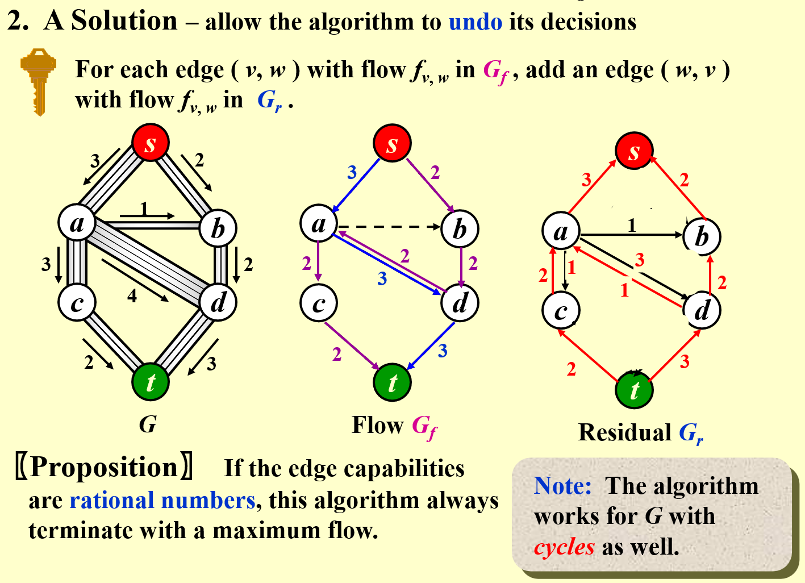
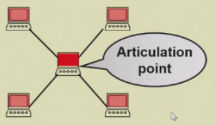
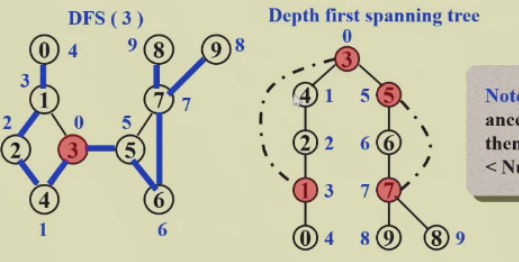
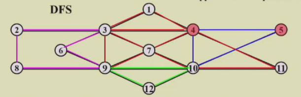

# 1 Definitions

- $G(V,E)$ 
	- G: graph
	- V: Vertex
	- E: Edge
- Direction 有向图(digraph)或无向图
	- 有向图 head->tail
- Restrictions
	- Selfloop is illegal 不存在自环
	- Multigraph is not considered 不存在重合的边
- **Complete graph**：完全图，所有点之间都有边
	- 有向或无向不同，有向是两倍
- **adjacent**
	- digraph 有 adjacent *to/from*
		- v_i -> v_j
		- v_i is adjacent *to* v_j, to 就是向右的箭头
		- v_j is adjacent *from* v_i, from 就是向左的箭头
- **Subgraph**
	- 顶点和边都是子集
- **Path**
	- $v_p$ 到 $v_q$ 的一系列边
	- Length of path: number of edges on the path
	- **Simple path**: 经过的节点不重复
	- **Cycle**: $v_p=v_q$ 的 simple path，绕一圈
	- **Connectness**: $v_p$ 和 $v_q$ 之间存在路径
	- **Connected graph**: 任意顶点之间连通
		- 对于无向图，只要*只有一个 component*，那么就连通
		- 或表述为，只要*每两个不同的顶点之间是连通的*
- **Component of an undirected G**: 最大的连通子图
- **Tree**: 连通的没有环的图 *a graph that is connected and* **acyclic**
- **DAG**: 有向无环图
	- 有先后顺序的神经网络算法
- **Strongly Connected DG**: 强连通有向图
	- 任意两个顶点之间都有一条有向路径
	- **Weakly Connected DAG**: 不是强连通（不全有有向路径），但是存在无向路径
	- **Strongly connected component**: 最大强连通子图
- **Degree(v)**: 一个顶点，存在 **Indegree** and **Outdegree**
	- **degree = indegree + outdegree**
	- $e = \sum d_i / 2$

## Representation of Graphs

### Adjacency Matrix 邻接矩阵

-  `adj_mat[i][j] = exist(i,j)? 1:0`
	- UDG: symmetric	
		- array: $adj\_mat[n(n+1)/2]=\{a_{11}, a_{12}, \dots , a_{1n}, a_{22}, \dots ,a_{2n}, \dots, a_{nn}\}$
	- DG: all needed
		- array: ...
	- degree
		- UDG:  $degree(i)=\sum_{j=0}^{n-1}adj\_mat[i][j]=\sum_{j=0}^{n-1}adj\_mat[j][i]$
		- DG: $degree(i)=\sum_{j=0}^{n-1}adj\_mat[i][j]+\sum_{j=0}^{n-1}adj\_mat[j][i]$
	- con
		- 存储开销 $O(N^2)$，特别是对于 *skewed graph*
		- 判别是否连通，时间复杂度 $O(N^w)$

### Adjacency Lists: Replace each row by a linked list

- 对于每个 node，构建一个 linear list，里面放本节点的 adjacents
	- order does not matter
- Space complexity
	- n nodes, e edges
	- UDG: $S = (n+2e)(ptrs)+2e(ints)$
	- DG: $S=(n+e)(ptrs)+e(ints)$
- Degree(i) 就是对应 list 的长度
- $T(N)=O(n+e)$

#### Inverse adjacency lists

- 构建 **inverse adjacency list** 表示哪些节点指向了本节点

#### Multilist representation for `adj_mat[i][j]`

- **Multilists**回忆十字链表，上课问题，多少人上课，这门课有多少人选修问题 ![[Blog/mkdocs-blog-project/emergent-space-obmd/ZJU Courses/2024 Spring/Fundamentals of Data Structure/Ch.03 List#Multilists]]
	- 每个节点有 `head list, tail list`

### Adjacency Multilists

- 使用 node 表示一条边
- $\{mark, v_1, v_2\}$
- 构造方法
	- 遍历所有 nodes `graph[i]`
		- 对于一个节点，找到第一个被引用的边 `adj_mul[j]`，从节点指向这个边
	- 将边从前往后进行指向被引用的位置


- **缺点？**
	- 构造麻烦
	- 存储开销一样，不算 mark 都有 $(n+2e)(ptrs)+2e(ints)$
- **优势**
	- mark 标记节点的 weight
	- mark 也可以表示边是否被 visit

### Weighted Edges

- `adj_mat[i][j]=weight`
	- 用的更多，因为有稀疏优化，实际使用矩阵多 *tensor*
- `adj_lists/multilists` add a weight

# 2 Topological Sort 拓扑排序

- Example: 学习课程的先修限制 *prerequisites*
	- 课程为结点，DG

## AOV Network (Activities on vertex)

- **predecessor**
	- *immediate & indirect*
- **successor**
- **Partial order** 偏序
	- 先修关系可以传递，不可自反 *transitive but irreflexive*
- **AOV must be a DAG** no cycle

## Definition

- 如果 i 为 j 的 predecessor，则 i 出现在 j 前面
- 每次选择没有 predecessor，即没有 indegree 的节点，并将它的后继的 indegree 减一（删去这个节点）
- 可能不是唯一的 *not unique*

## Solution

### Solution 1

- 使用一个 Counter 表示 visit 的节点数

```c
void Topsort( Graph G )
{
	int Counter;
	Vertex V,W;
	for(Counter = 0; Counter < NumVertex; Counter++){
		V = FindNewVertexOfDegreeZero();
		if(V == NotAVertex){    // a cycle means no indegree 0
			Error("Graph has a cycle"); break;
		}
		TopNum[V] = Counter; // out put in a array with value as the order
		for(each W adjacent from V) indegree[W]--; // notice that "from"
	}
}
```

- Time complexity $O(|V|^2)$
- **Improvement**
	- 解决 findnewdegreezero 太慢了，可以每次找到就放在一个 queue or stack 中，直接取就行，直到队列为空

### Solution 2

```c
void Topsort( Graph G )
{
	Queue Q;
	int Counter = 0;
	Vertex V, W;
	Q = CreateQueue(NumVertex); MakeEmpty(Q);
	for( each vertex V )
		if(indegree[V] == 0) Enqueue(V, Q);
	while(!isEmpty(Q)){
		V = Dequeue(Q);
		TopNum[V] = ++Counter; // assign next
		for(each W adjacent from V)
			if(--indegree[W] == 0) Enqueue(W,Q);
	}
	if(Counter != NumVertex)
		Error("Graph has a cycle");
	disposeQueue(Q);
}
```

- Time Complexity: $O(|V|+|E|)$
	- worst case: 退化成 $O(|V|^2)$

> [!hint] Uniqueness of Topological Sequence
> 如果 DAG 中任意两个顶点之间都存在一条*有向路径*，A 到 B 或者 B 到 A，那么一定是唯一的

# 3 Shortest Path Algorithms

- cost function $c(e)$ for $e\in E(G)$, describing **weighted path length**

## Single-Source Shortest-Path Problem

- 对于图中给定的一个点，找到到其他所有点的最短路径
- *Negative Cost* 过于复杂，可能导致无解，暂时不考虑

### Unweighted Shortest Paths

#### idea

- 从起点出发，找到能到达的节点，就是距离为 1 的节点，visit
	- Tree: Level-Order Traversal
	- **Breadth-first search(BFS)** 广度搜索

#### Implementation

- `Table[i].Dist ::= distance from s to v_i`
- `Table[i].Known[i] ::= 1 if visited, 0 if not`
- `Table[i].Path ::= for tracking the path` 指向上一个顶点的指针，可以逆向找出路径

##### imp 1

```c
void Unweighted ( Table T )
{
	int CurrDist;
	Vertex B, W;
	for(CurrDist = 0; CurrDist < NumVertex; CurrDist++){
		for(each vertex V) if(!T[V].Known && T[V].Dist == CurrDist){  // add another |V|, too slow
			T[V].Known = ture;
			for(each W adjacent to V) if(T[W].Dist == Infinity){
				T[W].Dist = CurrDist + 1;
				T[W].Path = V;
			}
		}
	}
}
```

- worst case, linear graph
- $T=O(|V|^2)$

##### imp 2

```c
void Unweighted( Teble T )
{
	Queue Q;
	Vertex V, W;
	Q = CreateQueue(NumVertex); MakeEmpty(Q);
	Enqueue(S, Q);  // Enqueue the source vertex
	while(!IsEmpty(Q)){
		V = Dequeue(Q);
		T[V].Known = true;  // not really necessary
		for(each W adjacent to V) if(T[W].Dist == Infinity){  // infty means not searched yet
			T[W].Dist = T.[V].Dist + 1;
			T[W].Path = V;
			Enqueue(W, Q);
		}
	}
	DisposeQueue(Q);
}
```

- 所有顶点都进行的 queue 操作
- 所有的边都走了一遍 
- $T=O(|V|+|E|)$

### Dijkstra's Algorithm(for weighted shortest paths)

- 使用集合 S 表示所有已经找到了最短路径的 vertex 的集合
- 对于不在 S 内的 vertex，定义距离为 S 中的 vertex 到它距离的最小值
- If the paths are generated in *non-decreasing order*, then
	- the shortest path must go through **ONLY** $v_i\in S$
	- 每次找到 S 距离最小的顶点，放入 S *Greedy Method*
	- 如果 `distance[u_1]<distance[u_2]`，把 `u_1` 放入 S，随后的 `distance[u_2]` 可能会变

```c
void Dijkstra( Table T )
{
	Vertex V, W;
	for(;;){ // O(|V|)
		V = smallest unknown distance vertex;
		if(V == NotAVertex) break;  // search done
		T[V].Known = ture;  // only visit the smallest dist vertex
		for(each W adjacent to V)  // update W
			if(!T[W].Known)
				if(T[V].Dist + Cvw < T[W].Dist){
					Decrease(T[W].Dist to T[V].Dist + Cvw);
					T[W].Path = V;
				}
	}
}
```

#### Implementation 1 直接遍历 ==Good if the graph is dense==

- V = smallest unknown distance vertex, *traverse the table $O(|V|)$*
- $T=O(|V|^2+|E|)$ **Good if the greph is dense**

#### Implementation 2 Minheap ==Good if the graph is sparse==

- V = smallest unknown distance vertex
	- **Keep distances in a priority queue and call DeleteMin $O(\log |V|)$**
- `Decrease(T[W].Dist to T[V].Dist + Cvw)`
	- Method 1: DecreaseKey $O(\log |V|)$
		- $T=O(|V|\log|V|+|E|\log|V|)=O(|E|\log|V|)$
	- Method 2: insert W with updated Dist into the priority queue
		- $T=O(|E|\log |V|)$
		- **But require |E| DeleteMin with |E| space**

#### Other improvements: Pairing heap (Ch.12) and Fibonacci heap (Ch.11)

### Graphs with Negative Edge Costs

```c
void  WeightedNegative( Table T )
{   /* T is initialized by Figure 9.30 on p.303 */
    Queue  Q;
    Vertex  V, W;
    Q = CreateQueue (NumVertex );  MakeEmpty( Q );
    Enqueue( S, Q ); /* Enqueue the source vertex */
    while ( !IsEmpty( Q ) ) { /*each vertex can dequeue at most |V| times*/
        V = Dequeue( Q );
        for ( each W adjacent to V )
  			if ( T[ V ].Dist + Cvw < T[ W ].Dist ) { /* no longer once per edge */
      			T[ W ].Dist = T[ V ].Dist + Cvw;
      			T[ W ].Path = V;
      			if ( W is not already in Q )
          			Enqueue( W, Q );
  } /* end-if update */
    } /* end-while */
    DisposeQueue( Q ); /* free memory */
}  /* negative-cost cycle will cause indefinite loop*/
```

-  $T=O(|V|*|E|)$
- 可以设置一个 `treshold`，如果一条边已经遍历超过这么多次，那么就认为是死循环，程序退出

### Acyclic Graphs *无环图*

-  回忆 [[Blog/mkdocs-blog-project/emergent-space-obmd/ZJU Courses/2024 Spring/Fundamentals of Data Structure/Ch.09 Graph Algorithms#2 Topological Sort 拓扑排序]] 里的无环图，AOV Network，$T=O(|E|+|V|)$

#### Application: AOE(Activity On Edge) Networks

- edge: **activity**
	- weight: 任务持续的时间
	- *dummy edge*: 任务存在先后关系，一个由另一个决定
- vertex: status
	- index of vertex
	- EC: earlist completion time for this node
	- LC: latest completion time for this node
- **CPM**: Critical Path Method


- **EC**：从起点开始往后计算，每次加上边，每个节点要取入度中最大的
- **LC**：从终点往前计算，每次减去边，每个节点要取出度中最小的
- **Slack Time**：*松弛时间*，这条边上完成任务之余可以 idle 的时间
- **Critical Path**：所有的 *slack time* 都是 0，*必须盯牢的任务线*

## All-Pairs Shortest Path Problem

For all pairs of $v_i$ and $v_j$ $(i\ne j)$ , find the shortest path between.

### Method 1 Use **single-source algorithm** for |V| times

- $T=O(|V|^3)$
- ==works fast on sparse graph==

### Method 2 *in Ch.10*

- ==works faster on dense graphs==

# 4 Network Flow Problems 网络流问题

- 每条边都存在最大流量限制，**有向图**
- 从 source 到 sind 的最大流量问题

## A Simple Algorithm

- 根据原始的 graph，创建两个 graph
	- Flow network $G_f$
	- Residual network $G_r$ *残差网络*
1. Find any path from **s** to **v** in $G_r$, called **Augmenting path**
2. Take the minimum edge on this path as the amount of flow and add to $G_f$ 找到瓶颈，在 flow 里整条路线上更新到这个流量
3. 并更新 residual
4. 如果 residual 中仍然存在 path，继续 step 1；否则结束


### 问题 1

- 如果使用 greedy method，可能提前导致路封死

## A Solution - allow the algorithm to *undo* its decision

- 更新 residual 时，加上反向的路径，有一个改错的机会
- **Proposition**: 如果边是**有理数**，一定会找到最大的流量
- **Note**: The algorithm works for G with *cycles* as well
- 

## Analysis ( If the capacities are all integers )

- An augmenting path can be found by an unweighied shortest path algorithm
	- $T=O(f*|E|)$, **f** is the maximum flow
- Always choose the augmenting path that allows the largest increase in flow *modify Dijkstra's algorithm*
	- $$T=T_{augmentation}*T_{find\space a\space path}=O(|E|\log cap_{max})*O(|E|\log |V|)=O(|E|^2\log |V|)$$
	- if cap_max *the maximum of capacity* is a small integer
- Always choose the augmenting path that has the least number of edges
	- $$T=T_{augmentation}*T_{find\,a\,path}=O(|E|)*O(|E|*|V|)=O(|E|^2|V|)$$ 
	- Note

# 5 Minimum Spanning Tree

**Definition**: A spanning tree of graph G is a tree which consists of **V(G)** and a **subset of E(G)**

- **acyclic**: the number of edges is |V|-1
- **minimun**: for the total cost of edges is minimized 所有的权重和最小
- **spanning**: it covers every vertex
- A minimum spanning tree exists iff G is **connected**
- Adding a non-tree edge to a spanning tree, we obtain a **cycle**

## Greedy Method

1. 只使用 graph 里有的边
2. 一定恰好使用 |V|-1 条边
3. 使用的边不能形成循环

### Prim's Algorithm - grow a tree

- Similiar to Dijkstra
- 每次选最小距离的

### Kruskal's Algorithm - maintain a forest

- 每次找距离最小的边
- 如果不形成 cycle，那么将树连接，删除这条边
- 如果形成 cycle，那么放弃这条边

```c
void Kruskal ( Graph G )
{
	T = {};
	while ( T contains less than |V|-1 edges && E is not empty ) {
		choose a least cost edge(V, w) from E;   // deleteMin
		delete (v, w) from E;
		if((v, w) does not create a cycle in T)
			add (v, w) to T;   // union and find
	}
	if(T contains fewer than |V|-1 edges)
		Error("No spanning tree");
}
```

> [!note] Time Complexity
> - 初始化一个空的边集 $O(1)$
> - 对边的权重进行排序 $O(|E|\log |E|)$
> - 按照边的权重从小到大，进行并查集操作 $O(|E|\log |V|)$
> 	- 如果采用 union-by-rank and path-compression，并查集能优化成 $O(|E|\alpha(|E|, |V|))$
> 	- 这里的 $\alpha$ 是反阿克曼函数，接近于常数
> - 所以，总体的时间复杂度为 $O(|E|\log |E|)$


# 6 Applications of Depth-First Search

*a generalization of preorder traversal*

```c
void DFS ( Vertex V )
{
	visited[V] = true;
	for(each W adjacent to V)
		if(!visited[W])
			DFS(W);
}
```

- $T=O(|E|+|V|)$
- BFS: 每次找一层*队列，while 循环* **VS** DFS: 每次先找到所有的*递归*

## Undirected Graphs

- DFS 能够访问的所有节点，**构成一个 component**

```c
void ListComponents( Graph G )
{
	for(each V in G)
		if(!visited[V]){
			DFS(V);
			printf("\n");	
		}   // 每次访问打印节点index，每两个component之间换行
}
```

## Biconnectivity



- **Articulation Point**: v is an articulation point if G' = deleteVertex(G, v) has **at least 2** connected components *如果把这个节点删掉之后，图被分开了*
- **Biconnected graph**: G is a biconnected graph if G is **connected** and **has no articulation points**
- A **biconnected component** is a *maximal biconnected subgraph*


### Finding the biconnected components

#### 1. Use DFS to obtain a spanning tree of G

- spanning tree 重新按照 visit 顺序编号，**得到 DFS number**
- **Back edges** 图中有但树中没有的边
- **Note**: if u is an ancestor of  v, then Num(u)<Num(v)

#### 2. Find the *articulation points* in G

- The *root* is an articulation point iff it has **at least 2 children**
- Any *other vertex* is an articulation point iff u has **at least 1 child**, ==and== it is impossible to **move down at least 1 step and then jump up to u's ancestor**
	- 至少有一个孩子，而且无法从后代中通过 *back edge* 回到祖先
	- 

#### 3. $Low(u)=min\{Num(u),min\{Low(w)|w\,is\,a\,child\,of\,u\},min\{Num(w)|(u,w)is\,a\,back\,edge\}\}$ 

- 是 **自己的 number**、**children 中最小的 low number**、**自己 backedge 另一头中最小的 number** 中最小的
- 计算 Low number
	- 
	1. **根节点** 的 low number 是 0
	2. 先找所有 **backedge** 影响的 low number *因为 backedge 要找的是另一头的 number， 已经全部已知*
	3. **DFS**，每次返回本节点的 low number，每次比较自己的 number 和所有返回值，取最小的

%%**Pseudo-code on p.327 and p.329**%%

#### 4. Therefore, u is an articulation point iff

- u is the **root** and has **at least 2 children**; or
- u is not the root, and has **at least 1 child** such that $Low(child)\ge Num(u)$

## Euler Circuits

- **Euler tour**: draw each line exactly once without lifting your pen from the paper *一笔画*
- **Euler curcuit**: draw each line exactly once without lifting your pen from the paper, **AND** finish at the startgin point
- Propositions
	- An Euler circuit is possible ==iff== the graph is connected and each vertex has an **even** degree.
	- An Euler tour is possible ==if== there are exactly **two** vertices having **odd** degree. One must start at one of the odd-degree vertices.

### algorithm



- the path should be maintained as a linked list
- for each adjacency list, maintain a pointer to the last edge scanned
- $T=O(|E|+|V|)$
- Other algorithm: *Hamilton Cycle*