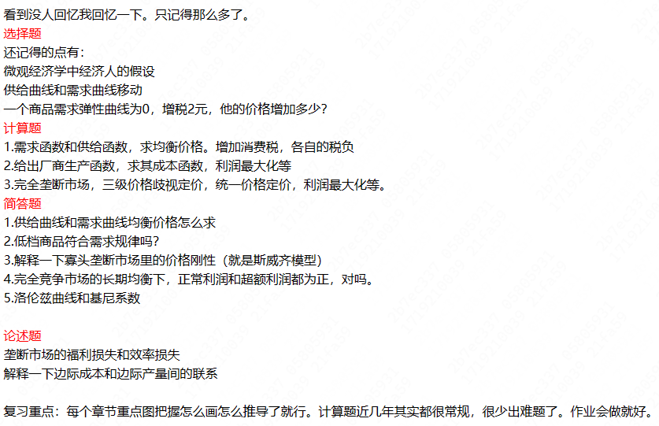
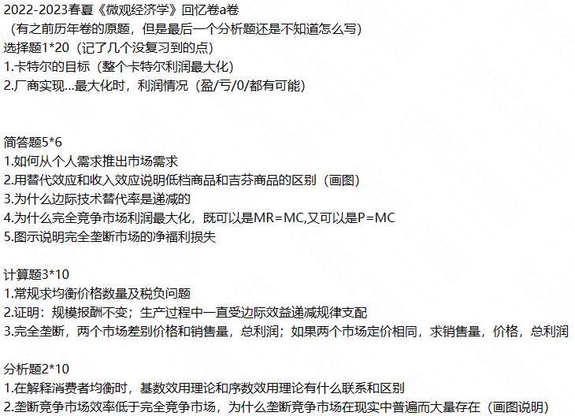
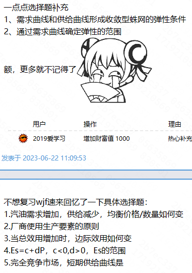
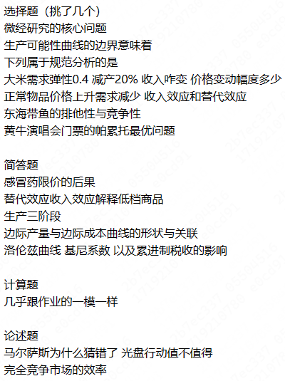

# Strategy

- 上课记很多笔记
- 课后作业认真完成
- 及时复习，做题目

# Processing

- 第一次作业错的比较多，不知道怎么扣分

# Final

- **可以带计算器入场**

## 题型

- 选择 *15\*1*
- 简答题 *5\*7*
- 计算题 *3\*10*
- 分析题 *2\*10*

## 资料

- 历年卷 #temp/期末资料补充 
	- cc 98
		- [2023—2024秋冬学期微观经济学（甲）回忆卷（微经） - CC98论坛](https://www.cc98.org/topic/5805931)
	- 群里样卷
- github
	- [Slides](https://github.com/QSCTech/zju-icicles/tree/master/%E5%BE%AE%E8%A7%82%E7%BB%8F%E6%B5%8E%E5%AD%A6%EF%BC%88%E7%94%B2%EF%BC%89/PPT)
	- 两份笔记
- 绿皮书《微观经济学教程》*以及答案*
- ppt 上的选择题？ #temp/期末资料待定 

## 6.24

> [!NOTE]- [2023—2024秋冬学期微观经济学（甲）回忆卷（微经） - CC98论坛](https://www.cc98.org/topic/5805931)
> 

> [!NOTE]- [2022-2023春夏《微观经济学（甲）》回忆卷a卷//微经/味精 - CC98论坛](https://www.cc98.org/topic/5635869)
> 
> 

> [!NOTE]- [《微观经济学》2022-2023秋冬学期期末考回忆卷 - CC98论坛](https://www.cc98.org/topic/5504516)
> 

> [!NOTE] [2021-2022春夏微观经济学简单回忆卷以及复习建议 - CC98论坛](https://www.cc98.org/topic/5360992)
> 借楼分享一下感想吧 mooc有用，可以三倍速对照ppt刷一遍 98之前前辈分享的笔记有用，刷完mooc直接看笔记就行，基本上考的都有，包括lz说的阿尔法加兰姆达的值和一比较的问题笔记里也有 消费券那题是作业原题，感觉考的大题作业或者mooc里都有对应的 绿皮书我没看，对着答案把习题看了一遍，平时作业题就是绿皮书习题，基本看完以后计算题差不多都会做了 总结一下我的复习流程是mooc三倍速刷一遍，笔记看一遍，绿皮书习题答案看一遍，还有98前辈分享的大题看一下，总共花的时间算一下不会超过两天 最后4.8，外专业零基础，不是dl，供参考

- 复习经验
	- [2022-23春夏-微观经济学甲/微经（经济学专业ver./史晋川 叶建亮ver.）笔记＋心得 - CC98论坛](https://www.cc98.org/topic/5638213)
	- [微观经济学有没有速成的办法 - CC98论坛](https://www.cc98.org/topic/5604898)
		- 浙大微经教程 + mooc ljq
	- [2021-2022春夏微观经济学简单回忆卷以及复习建议 - CC98论坛](https://www.cc98.org/topic/5360992)
	- [《微观经济学（甲)》补天指南//微经 - CC98论坛](https://www.cc98.org/topic/5636353)
- 题目
	- [微观经济学试题求助 - CC98论坛](https://www.cc98.org/topic/5576483)
- 资料
	- [浙大版微观经济学部分课后主观题答案 - 百度文库 (baidu.com)](https://wenku.baidu.com/view/612b11d29dc3d5bbfd0a79563c1ec5da50e2d612.html?_wkts_=1719210814904)
	- 蓝田历年卷
	- 绿皮书课后题
	- [微观经济学（甲）许云华ppt - CC98论坛](https://www.cc98.org/topic/5636082)
	- mooc

## Roadmap

**目标满绩**

- [ ] 题目
	- [ ] 历年卷
		- [ ] 样卷
		- [ ] 打印
	- [ ] 教程 *有答案*
- [ ] 复习资料
	- [ ] 所有作业题
	- [ ] 98 笔记
	- [ ] *mooc*
		- [ ] mooc 选择题不错
	- [ ] *ppt*