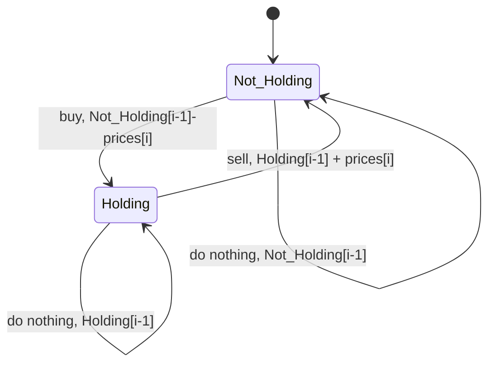
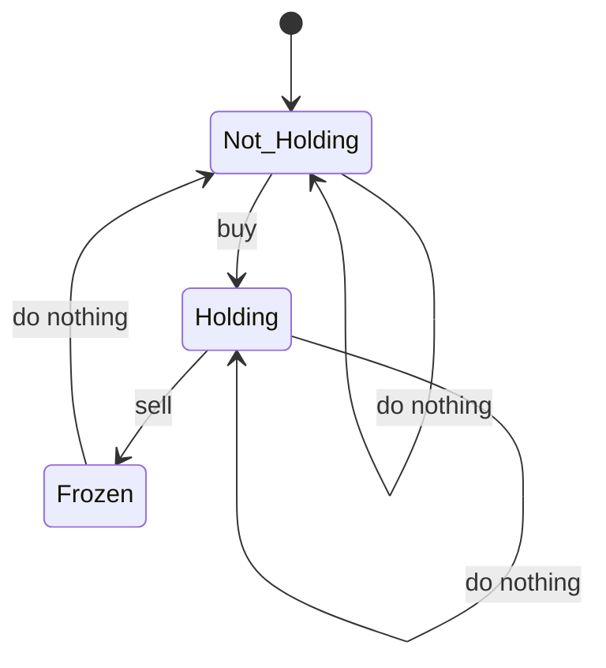

---
status:
  - archived
tags: CS/Algorithm/Dynamic-Programming
date_created: 2024-12-23T16:26:54
date_modified: 2025-09-13T10:18:05
number headings: auto, first-level 1, max 6, contents ^toc, skip ^skipped, 1.1
---

# 1 总结

## 1.1 背包问题

- 背包：一个总和
- 物品：背包里装的元素

### 1.1.1 不同的遍历方式

|      | 不考虑顺序        | 考虑顺序         |      |
| ---- | ------------ | ------------ | ---- |
| 使用多次 | 逆序更新<br>外层物品 | 正序更新<br>外层容量 | 正序更新 |
| 使用一次 | 逆序更新<br>外层物品 | 逆序更新<br>外层容量 | 逆序更新 |
|      | 外层物品         | 外层容量         |      |

> [!question]- 物品重复使用，不考虑物品放入顺序
> 给你一个整数 `n` ，返回 _和为 `n` 的完全平方数的最少数量_ 。
>
> **完全平方数** 是一个整数，其值等于另一个整数的平方；换句话说，其值等于一个整数自乘的积。例如，`1`、`4`、`9` 和 `16` 都是完全平方数，而 `3` 和 `11` 不是。
>
> **示例 1：**
>
> **输入：**n = `12`
> **输出：**3
> **解释：**`12 = 4 + 4 + 4`
>
> **示例 2：**
>
> **输入：**n = `13`
> **输出：**2
> **解释：**`13 = 4 + 9`
>
>  
>
> **提示：**
>
> - `1 <= n <= 104`

- 外层物品
	- 内层容量
		- 顺序更新，允许多次使用

> [!question]- 物品重复使用，并考虑物品放入顺序
> 给你一个由 **不同** 整数组成的数组 `nums` ，和一个目标整数 `target` 。请你从 `nums` 中找出并返回总和为 `target` 的元素组合的个数。
>
> 题目数据保证答案符合 32 位整数范围。
>
> **示例 1：**
>
> **输入：**nums = [1,2,3], target = 4
> **输出：**7
> **解释：**
> 所有可能的组合为：
> (1, 1, 1, 1)
> (1, 1, 2)
> (1, 2, 1)
> (1, 3)
> (2, 1, 1)
> (2, 2)
> (3, 1)
> 请注意，顺序不同的序列被视作不同的组合。
>
> **示例 2：**
>
> **输入：**nums = [9], target = 3
> **输出：**0
>
> **提示：**
>
> - `1 <= nums.length <= 200`
> - `1 <= nums[i] <= 1000`
> - `nums` 中的所有元素 **互不相同**
> - `1 <= target <= 1000`

- 外层容量
	- 内层物品
		- 顺序更新，允许多次使用

> [!question]- 物品单次使用，不考虑物品放入顺序
> [[ADS 08 Dynamic Programming#8.2.2 Programming Contest]] 这里的 `happy_score`

- 外层物品
	- 内层容量
		- 逆序更新，保证只使用一次

> [!question]- 物品单次使用，并考虑物品放入顺序
> **题目：** 给定一个整数数组 `nums` 和一个目标整数 `target`，数组中的每个元素代表一个物品的重量，`target` 代表背包的总容量。每个物品只能使用一次，且物品放入背包的顺序会影响背包的总价值。我们需要找出所有可能的组合，使得放入背包的物品总重量恰好等于 `target`，并且计算这些组合的总价值之和。
>
> **示例：** **输入：** `nums = [1, 2, 3]`, `target = 5` **输出：** `9` **解释：** 所有可能的组合为：
>
> - (1, 2, 2) 总价值为 1 + 2 + 2 = 5
> - (1, 3, 1) 总价值为 1 + 3 + 1 = 5
> - (2, 3) 总价值为 2 + 3 = 5
> 
> 请注意，顺序不同的序列被视作不同的组合，例如 (1, 2, 2) 和 (2, 1, 2) 是不同的组合。
>
> **提示：**
>
> - `1 <= nums.length <= 100`
> - `1 <= nums[i] <= 100`
> - `1 <= target <= 1000`
> 
> > 也就是，一个背包如果能用不同顺序放下统一些物品，那么它的总价值

- 外层容量
	- 内层物品
		- 逆序更新，保证使用一次

> [!NOTE] 总结
> - 有顺序先容量
> - 多次正单次倒

## 1.2 状态机

### 1.2.1 一般股票问题

> 假设有一只股票的价格是 `prices[]`，可以买入卖出无数次，但只能同时持有一支股票，求最大的利润

在第 $i$ 天，考虑这样的状态机



- 所以可以建立 `hold, nhold` 两个数组，分别表示在第 $i$ 天持有和不持有的最大利润（$i$ 从 1 开始）
- 初始化：
	- `hold[0]=-inf` 表示还没开始时 hold 不合法
	- `nhold[0]=0` 表示还没开始时利润为 0
- 状态转移方程
	- `hold[i] = max(hold[i-1], nhold[i-1] - prices[i])`
	- `nhold[i] = max(nhold[i-1], hold[i-1] + prices[i])`

```c title="一般买股票"
int maxProfit(int* prices, int n) {
    int hold[n + 1], nhold[n + 1];
    hold[0] = -1e9;
    nhold[0] = 0;
    for (int i = 1; i <= n; i++) {
        int price = prices[i - 1];
        hold[i] = max(hold[i - 1], nhold[i - 1] - price);
        nhold[i] = max(nhold[i - 1], hold[i - 1] + price);
    }
    return nhold[n];
}
```

### 1.2.2 变式 1: 冷冻期

> [309. 买卖股票的最佳时机含冷冻期 - 力扣（LeetCode）](https://leetcode.cn/problems/best-time-to-buy-and-sell-stock-with-cooldown/?envType=study-plan-v2&envId=dynamic-programming)



```c title="冷冻期"
int maxProfit(int* prices, int pricesSize) {
    int n = pricesSize;
    int hold[n + 1], nhold[n + 1], freeze[n + 1];
    hold[0] = freeze[0] = -1e9;
    nhold[0] = 0;
    for (int i = 1; i <= n; i++) {
        int price = prices[i - 1];
        hold[i] = max(hold[i - 1], nhold[i - 1] - price);
        nhold[i] = max(nhold[i - 1], freeze[i - 1]);
        freeze[i] = hold[i - 1] + price;
    }
    for (int i = 0; i <= n; i++) {
        printf("%d %d %d\n", hold[i], nhold[i], freeze[i]);
    }
    return max(freeze[n], nhold[n]);
}
```

> [!attention]
> 这里不存在 frozen -> holding，因为 `frozen[i]` 表示的是第 `i+1` 天不能购买，所以 frozen 后一天只能到 not holding

## 1.3 变式 2: 手续费

> [714. 买卖股票的最佳时机含手续费 - 力扣（LeetCode）](https://leetcode.cn/problems/best-time-to-buy-and-sell-stock-with-transaction-fee/description/?envType=study-plan-v2&envId=dynamic-programming)

- 卖出的时候需要缴纳固定的手续费
- 这个比较简单，在 `nhold` 更新的逻辑里把手续费减掉就行了

## 1.4 变式 3: 最多完成 $k$ 笔交易

> [123. 买卖股票的最佳时机 III - 力扣（LeetCode）](https://leetcode.cn/problems/best-time-to-buy-and-sell-stock-iii/?envType=study-plan-v2&envId=dynamic-programming)

```c title="最多买 k 次"
int maxProfit(int k, int* prices, int pricesSize) {
    int sell[k + 1], buy[k + 1];
    int n = pricesSize;
    for (int i = 1; i <= k; i++) {
        buy[i] = -prices[0];
        sell[i] = 0;
    }
    for (int i = 1; i < n; i++) {
        int price = prices[i];
        buy[1] = max(buy[1], -price);
        sell[1] = max(sell[1], buy[1] + price);
        for (int j = 2; j <= k; j++) {
            buy[j] = max(buy[j], sell[j - 1] - price);
            sell[j] = max(sell[j], buy[j] + price);
        }
    }
    return sell[k];
}
```

- `buy[i]` 表示进行第 $i$ 次购买后的最大收益
- `sell[i]` 表示进行第 $i$ 次出售后获得的最大收益
- 由于同一天里卖了又买相当于没有操作，所以当成直接买 $k$ 次算就行了

# 2 Ex8

## 2.1 Decode

> [!question]-
> Suppose that a string of English letters is encoded into a string of numbers. To be more specific, `A`-`Z` are encoded into `0`-`25`. Since it is not a prefix code, the decoded result may not be unique. For example, `1213407` can be decoded as `BCBDEAH`, `MBDEAH`, `BCNEAH`, `BVDEAH` or `MNEAH`. Note that `07` is not `7`, hence cannot be decoded as `H`.
>
> Your job is to tell in how many different ways we can decode a numeric string.
>
> **Format of function**:
>
> ```c++
> int Decode( char NumStr[] );
> ```
>
> where `NumStr` is a string consisting of only the numbers `0`-`9`.
>
> The function `Decode` is supposed to return the number of different ways we can decode `NumStr`.
>
> **Since the answer might be super large, you only need to output the answer modulo 1000000007.**
>
> **Sample program of judge**:
>
> ```c++
> #include <stdio.h>
> #include <string.h>
> 
> #define MAXN 100
> #define BASE 1000000007
> 
> int Decode( char NumStr[] );
> 
> int main()
> {
>     char NumStr[MAXN];
> 
>     scanf("%s", NumStr);
>     printf("%d", Decode(NumStr));
> 
>     return 0;
> }
> 
> /* Your function will be put here */
> ```
>
> **Sample Input**:
>
> ```
> 1213407
> ```
>
> **Sample Output**:
>
> ```
> 5
> ```

- 定义 `dp[i]` 是前 `i` 个字符的结果，直接看代码就好了

> [!bug]
> 这题要求空字符串要输出 `0`，但是并没有讲清楚这个要求。


## 2.2 Manager of Tasks

> [!question]- Question
> There are $N$ tasks arranged in a sequence on a machine waiting to be executed, and their order cannot be changed. You need to divide these $N$ tasks into several groups, each containing several consecutive tasks. Starting from time 0, the tasks are processed in groups, and the time required to execute the $i$-th task is $T_i​$. Additionally, the machine requires a startup time $S$ before each group of tasks begins, so the time required for a group of tasks is the startup time $S$ plus the sum of the time required for each task in this group.
>
> After a task is executed, it will wait briefly in the machine until all tasks in that group are completely executed. That is to say, the tasks in the same group will be completed at the same time. The cost of each task is its completion time multiplied by a cost coefficient $C_i​$.
>
> Please plan a grouping scheme for the machine to minimize the total cost.
>
> For all testing data, $1\leq N\leq 1000,0\leq S\leq 50,1\leq T_{i},C_{i}\leq_{1}00$
>
> ### Function Interface:
>
> ```c++
> long long min_cost(int N, int S, int T[], int C[]);
> ```
>
> where `T, C` are arrays of integers with `N` elements, and `S` is the startup time S mentioned above.
>
> ### Judge Program:
>
> ```c++
> #include <stdio.h>
> #define MAXN 1000
> long long min_cost(int N, int S, int T[], int C[]);
> int main() {
>     int N, S;
>     int T[MAXN], C[MAXN];
>     scanf("%d%d", &N, &S);
>     for (int i = 0;i < N; ++ i) {
>         scanf("%d%d", &T[i], &C[i]);
>     }
>     printf("%lld\n", min_cost(N, S, T, C));
>     return 0;
> }
> /* Your function will be put here */
> ```
>
> ### Sample Input:
>
> ```in
> 5
> 1
> 1 3
> 3 2
> 4 3
> 2 3
> 1 4
> ```
>
> ### Sample Output：
>
> ```out
> 153
> ```
>
> ### Sample Explanation
>
> We have grouped the tasks into 3 groups, which are `{1, 2}, {3}, {4, 5}`. The completion time corresponding to each task, in the order of the task numbers, is `{5, 5, 10, 14, 14}`. Similarly, the cost corresponding to each task, again in the order of the task numbers, is `{15, 10, 30, 42, 56}`. The total cost of these tasks is 153.

### 2.2.1 $O(N^3)$ method

> [!note] 分析
> - 这题比较麻烦，由于 $S$ 的存在，前面的分组会影响后面的完成时间，所以**前 $i$ 个任务的最优安排并不是总体的最优子结构**
> - 这个时候，可以**强行增加条件，构造最优子结构**，通过使用 `mins[i][j]` 表示将前 $i$ 个 jobs 分成 $j$ 个 groups，`mins[j][k-1]` 有机会成为 `mins[i][k]` 的最优子结构


### 2.2.2 $O(N^2)$ method

> [!NOTE] 进一步优化
> - 为什么前面用了 $O(N^3)$ 的时间呢？因为每次决策都有后效性
> - 为了让问题没有后效性，可以将每次分组后多加的 $S$ 时间偏移带来的 penalty 也考虑进去
> 	- `penalty = S * left_coefficient`

#### 2.2.2.1 Code %% fold %%

```c title="Manager of Tasks O(N^2)"
long long dp[MAXN+5];
long long preT[MAXN+5];
long long preC[MAXN+5];

long long min(long long a, long long b){
    return a<b?a:b;
}

#define INF 1e9

long long min_cost(int N, int S, int T[], int C[]){
    if(N==0) return 0;
    memset(dp, 0x3f, sizeof(dp));
    preT[0]=preC[0]=dp[0]=0;
    for(int i=1;i<=N;i++){
        preT[i]=preT[i-1]+T[i-1];
        preC[i]=preC[i-1]+C[i-1];
    }
    for(int i=1;i<=N;i++){
        for(int j=0;j<=i;j++){
            long long remainC=preC[N]-preC[i];
            long long sumC=preC[i]-preC[j];
            long long new_cost=dp[j]+S*remainC+(S+preT[i])*sumC;  // 计算 cost 的时候，就不用考虑前面 group 的 S 时间，只用考虑自己的 S 时间的影响就行了
            dp[i]=min(dp[i],new_cost);
        }
    }
    return dp[N];
}
```

# 3 LeetCode

## 3.1 最大正方形

在一个由 `'0'` 和 `'1'` 组成的二维矩阵内，找到只包含 `'1'` 的最大正方形，并返回其面积。

> [!tip] Tip
> 关键在于，如果 `matrix[i][j]=1`，那么 $dp[i][j]=\min\{dp[i-1][j],dp[i-1][j-1],dp[i][j-1]\}+1$，否则 $dp[i][j]=0$，可以自己验证一下是对的

### 3.1.1 code %% fold %%

```cpp
class Solution
{
public:
    int maximalSquare(vector<vector<char>> &matrix)
    {
        const int rows = matrix.size();
        const int cols = matrix[0].size();
        vector<vector<int>> mat(rows, vector<int>(cols));
        mat[0][0] = (int)(matrix[0][0] - '0');
        int max = mat[0][0];
        for (int i = 1; i < rows; i++)
        {
            mat[i][0] = (int)(matrix[i][0] - '0');
            if (mat[i][0])
                max = 1;
        }
        for (int i = 1; i < cols; i++)
        {
            mat[0][i] = (int)(matrix[0][i] - '0');
            if (mat[0][1])
                max = 1;
        }
        for (int i = 1; i < rows; i++)
        {
            for (int j = 1; j < cols; j++)
            {
                if (matrix[i][j] == '0')
                {
                    mat[i][j] = 0;
                    continue;
                }
                int l = mat[i][j - 1];
                int u = mat[i - 1][j];
                int ul = mat[i - 1][j - 1];
                l = min(u, l);
                ul = min(l, ul);
                mat[i][j] = ul + 1;
                if (mat[i][j] > max)
                    max = mat[i][j];
            }
        }
        return max * max;
    }
};
```

## 3.2 删除并获得点数

> [!question] Question
> 给你一个整数数组 `nums` ，你可以对它进行一些操作。
>
> 每次操作中，选择任意一个 `nums[i]` ，删除它并获得 `nums[i]` 的点数。之后，你必须删除 **所有** 等于 `nums[i] - 1` 和 `nums[i] + 1` 的元素。
>
> 开始你拥有 `0` 个点数。返回你能通过这些操作获得的最大点数。

1. 首先做一个 count bucket 来进行计数
2. $dp[i]=\max\{dp[i-1],dp[i-2]+i \cdot count[i]\}$ 表示考虑了 $[0,i]$ 里所有数字的子问题
	- 如果用了 $i-1$，就不能用 $i$
	- 如果没用 $i-1$，可以用 $i$

## 3.3 不同路径 II

> [!question] Question
> 给定一个 `m x n` 的整数数组 `grid`。一个机器人初始位于 **左上角**（即 `grid[0][0]`）。机器人尝试移动到 **右下角**（即 `grid[m - 1][n - 1]`）。机器人每次只能向下或者向右移动一步。
>
> 网格中的障碍物和空位置分别用 `1` 和 `0` 来表示。机器人的移动路径中不能包含 **任何** 有障碍物的方格。
>
> 返回机器人能够到达右下角的不同路径数量。
>
> 测试用例保证答案小于等于 `2 * 109`。

1. **如果起点是障碍，直接返回 `false`**
2. 初始化 $dp$ 的第一行和第一列，如果是障碍，此格子的方法数为 0，否则是上一个格子的方法数（0 或 1）
3.

$$
dp[i][j]=\begin{cases}0&\text{ if }grid[i][j]=1\\dp[i-1][j]+dp[i][j-1]&\text{ if }grid[i][j]=0\end{cases}
$$

## 3.4 三角形最小路径和

> [!question] Question
> 给定一个三角形 `triangle` ，找出自顶向下的最小路径和。
>
> 每一步只能移动到下一行中相邻的结点上。**相邻的结点** 在这里指的是 **下标** 与 **上一层结点下标** 相同或者等于 **上一层结点下标 + 1** 的两个结点。也就是说，如果正位于当前行的下标 `i` ，那么下一步可以移动到下一行的下标 `i` 或 `i + 1` 。
>
> ![[__assets/ADS 08 Dynamic Programming/IMG-ADS 08 Dynamic Programming-20241220194433549.webp]]
>
> > 非常经典的一题

1. 使用 bottom-up 才能构建子问题
2. $dp[i][j]$ 表示往上到达 $i$ 层第 $j$ 个元素的最短路径权重
3.

$$
dp[i][j]=\min\{dp[i+1][j],dp[i+1][j+1]\}+triangle[i][j]
$$

4. 返回 $dp[0][0]$

### 3.4.1 空间优化

1. 可以不使用二维 $dp$ 数组，让每次更新直接覆写到一维数组的 $dp[j]$，最后返回 $dp[0]$，这是因为不会存在顺序问题
2. 可以不使用 $dp$ 数组，直接使用传入的 `triangle` 的最后一行

## 3.5 最长回文子串

> [!question] Question
> 给你一个字符串 `s`，找到 `s` 中最长的回文子串。
>
> > 子字符串是**连续**的**非空**字符序列

1. $dp[i][j]=\text{true}$ 如果 `s[i...j]` 是回文串
2. 初始化长度为 1 和 2 的情况，写入 $dp$
3.

$$
dp[i][j]=\begin{cases}\text{true}&\text{if }dp[i-1][j+1]\land s[i]=s[j]    \\\text{false}&\text{others}\end{cases}
$$

4. 过程中记录 true 的最大长度和起点，最后找到对应的字符串并返回

> [!hint]
> 关键在于想到回文子串是连续的，而且可以构建 `bool` 类型的 $dp$ 数组

## 3.6 单词拆分

> [!question] Question
> 给你一个字符串 `s` 和一个字符串列表 `wordDict` 作为字典。如果可以利用字典中出现的一个或多个单词拼接出 `s` 则返回 `true`。
>
> **注意：**不要求字典中出现的单词全部都使用，并且字典中的单词可以重复使用。

1. $dp[i]=\text{true}$ 表示前 $i$ 个字符构成的字符串满足题意
2. $dp[0]=\text{true}$
3. $dp[i]=\bigvee_{k=0}^{i-1}(dp[k]\land s[k+1\dots i]\text{ is in dict})$

> [!tip] Tip
> 可以将 `wordDict` 构造成 set 来加速查找过程

## 3.7 最长回文子序列

> [!question] Question
> 给你一个字符串 `s` ，找出其中最长的回文子序列，并返回该序列的长度。
>
> 子序列定义为：不改变剩余字符顺序的情况下，删除某些字符或者不删除任何字符形成的一个序列。
>
> > 注意**子序列**和**子串**不同，可以是不连续的

1. $dp[i][j]$ 表示 `s[i...j]` 中最长回文子序列的长度
2. 初始化 `len=1, 2` 的情况，和 [[#3.5 最长回文子串]] 一样
3.

$$
dp[i][j]=\begin{cases}dp[i-1][j-1]+2&\text{if }s[i]=s[j]\\  \max\{dp[i-1][j],dp[i][j-1]\}&\text{else}\end{cases}
$$

	- 如果 `s[i]!=s[j]`，最外面的回文字符仍然可能是 `s[i], s[j]` 其中一个，但不可能是两个

## 3.8 编辑距离

> [!question] Question
> 给你两个单词 `word1` 和 `word2`， _请返回将 `word1` 转换成 `word2` 所使用的最少操作数_  。
>
> 你可以对一个单词进行如下三种操作：
>
> - 插入一个字符
> - 删除一个字符
> - 替换一个字符

1. 使用 `int dp[len1+1][len2+1]`，$dp[i][j]$ 表示 `word1[0...i-1]` 转换到 `word2[0...j-1]` 的编辑距离，其中 $i,j=0$ 表示空字符串
2.

$$
dp[i][j]=\begin{cases}dp[i-1][j-1]&\text{if }word_{1}[i-1]=word_{2}[j-1]\\  \min\{dp[i-1][j-1], dp[i-1][j], dp[i][j-1]\}+1&\text{else}\end{cases}
$$

	- 如果最后两个已经相同，很简单
	- 如果最后两个不相同，可以是
		- 最后一个替换，`word1[0...i-1]` 变成 `word2[0...j-1]`
		- 最后一个删除，`words[0...i-1]` 变成 `word2[0...j]`
		- `words[0...i]` 变成 `words[0...j-1]`，添加最后一个字符

## 3.9 不同的子序列

> [!question] Question
> 给你两个字符串 `s` 和 `t` ，统计并返回在 `s` 的 **子序列** 中 `t` 出现的个数，结果需要对 109 + 7 取模。

1. 仍然使用与上面题目类似的方法，设 $dp[i][j]$ 表示子问题 `s[0...i-1]` 和 `t[0...j-1]`
2.

$$
dp[i][j]=\begin{cases}dp[i-1][j-1]+dp[i-1][j]&\text{if }s[i-1]=t[j-1]\\ dp[i-1][j]&\text{else}\end{cases}
$$

	- 如果最后一个字符匹配上了，那么 `s[0...i-2]` 中所有能够匹配 `t[0...j-2]` 的子序列必然和 `s[i-1]` 构成与 `t[0...j-1]` 匹配的子序列，所以增加了 $dp[i-1][j-1]$ 个匹配

## 3.10 最长递增子序列

> [!question] Question
> 给你一个整数数组 `nums` ，找到其中最长严格递增子序列的长度。
>
> **子序列** 是由数组派生而来的序列，删除（或不删除）数组中的元素而不改变其余元素的顺序。例如，`[3,6,2,7]` 是数组 `[0,3,1,6,2,2,7]` 的子序列。

1. $dp[i]$ 表示以 `nums[i]` 为最后一个元素的最长的递增子序列长度，全部初始化为 1
2. $dp[i]=\max\{1,\{dp[k]+1\,|\,\forall\, 0\leq k<i, nums[k]<nums[i]\}\}$
	- 如果当前的数字能够放到前面的最长递增子序列后面，就放

## 3.11 最长定差子序列

> [!question] Question
> 给你一个整数数组 `arr` 和一个整数 `difference`，请你找出并返回 `arr` 中最长等差子序列的长度，该子序列中相邻元素之间的差等于 `difference` 。
>
> **子序列** 是指在不改变其余元素顺序的情况下，通过删除一些元素或不删除任何元素而从 `arr` 派生出来的序列。

1. $dp[i]$ 表示以数字 $i$ 为结尾的最长定差子序列的长度
	- 遍历 `arr`，转移方程为 $dp[arr[i]]=dp[arr[i]-difference]+1$
	- 这里默认 $dp[]$ 初始都是 0，也符合 `map` 的实现
2. 使用 `unordered_map` 减少空间占用

## 3.12 俄罗斯套娃信封问题

> [!question] Question
> 给你一个二维整数数组 `envelopes` ，其中 `envelopes[i] = [wi, hi]` ，表示第 `i` 个信封的宽度和高度。
>
> 当另一个信封的宽度和高度都比这个信封大的时候，这个信封就可以放进另一个信封里，如同俄罗斯套娃一样。
>
> 请计算 **最多能有多少个** 信封能组成一组“俄罗斯套娃”信封（即可以把一个信封放到另一个信封里面）。
>
> **注意**：不允许旋转信封。

1. 进行排序，函数为 `[&](const vector<int>& a, const vector<int>& b){ return a[0] < b[0] || (a[0] == b[0] && a[1] > b[1]) }`
	- `w` 相同时，按照 `h` 逆序排序，这样就能够避免一个 `w` 值中有多个信封是递增的，可以实现一个 `w` 只选一个信封
2. 可以使用二分查找来加速循环，不然会超时

## 3.13 找出每个位置为止的最长有效障碍赛路线

> [!question] Question
> 你打算构建一些障碍赛跑路线。给你一个 **下标从 0 开始** 的整数数组 `obstacles` ，数组长度为 `n` ，其中 `obstacles[i]` 表示第 `i` 个障碍的高度。
>
> 对于每个介于 `0` 和 `n - 1` 之间（包含 `0` 和 `n - 1`）的下标  `i` ，在满足下述条件的前提下，请你找出 `obstacles` 能构成的最长障碍路线的长度：
>
> - 你可以选择下标介于 `0` 到 `i` 之间（包含 `0` 和 `i`）的任意个障碍。
> - 在这条路线中，必须包含第 `i` 个障碍。
> - 你必须按障碍在 `obstacles` 中的 **出现顺序** 布置这些障碍。
> - 除第一个障碍外，路线中每个障碍的高度都必须和前一个障碍 **相同** 或者 **更高** 。
> 
> 返回长度为 `n` 的答案数组 `ans` ，其中 `ans[i]` 是上面所述的下标 `i` 对应的最长障碍赛跑路线的长度。

1. 目标是找到不严格单调递增子序列
2. 考虑维护一个数组，$d[i]$ 表示长度为 $i$ 的严格递增子序列的最小结尾元素
3. 当遍历到一个元素的时候
	1. 如果这个元素比 $d$ 中最后一个元素都大，那么显然可以放到 $d$ 后面，找到了更长的子序列
	2. 如果这个元素没有最后一个元素大，就找到其在 $d$ 中的 `upper_bound`，因为允许相等，将 `upper_bound` 位置的元素更新成这个元素（这个元素显然比 `upper_bound` 位置的元素更小）
	3. 每次考虑完一个 $d[i]$，都要输出它在 $d$ 中替换的位置 +1，也就是它对应的子序列长度

```cpp
class Solution {
public:
    vector<int> longestObstacleCourseAtEachPosition(vector<int>& obstacles) {
        vector<int> d, ans;
        for (int ob: obstacles) {
            // 这里需要改成 >=
            if (d.empty() || ob >= d.back()) {
                d.push_back(ob);
                ans.push_back(d.size());
            }
            else {
                // 将 300 题解中的二分查找改为 API 调用使得代码更加直观
                // 如果是最长严格递增子序列，这里是 lower_bound
                // 如果是最长递增子序列，这里是 upper_bound
                int loc = upper_bound(d.begin(), d.end(), ob) - d.begin();
                ans.push_back(loc + 1);
                d[loc] = ob;
            }
        }
        return ans;
    }
};
```

## 3.14 买股票的最佳时机 III

> [!question] Question
> 给定一个数组，它的第 `i` 个元素是一支给定的股票在第 `i` 天的价格。
>
> 设计一个算法来计算你所能获取的最大利润。你最多可以完成 **两笔** 交易。
>
> **注意：**你不能同时参与多笔交易（你必须在再次购买前出售掉之前的股票）。
>
> > 状态机

1. 一共有四种状态，第一次买入、第一次卖出、第二次买入、第二次卖出
2. 记录 `dp[0...3]` 分别表示第 `i` 天进行上述操作分别得到的最大收益
	- 初始
		- `dp[0] = -prices[0], dp[1] = dp[0] + prices[0] = 0` 这是因为如果同一天买入卖出相当于没变
		- `dp[2] = dp[1] - prices[0], dp[3] = dp[2] + prices[0]`
	- 每天进行更新，每个状态的收益都重新取 max
3. 好像不能同时参与多笔交易并没有什么很大的影响

```cpp
class Solution {
public:
    int maxProfit(vector<int>& prices) {
        int n = prices.size();
        int buy1 = -prices[0], sell1 = 0;
        int buy2 = -prices[0], sell2 = 0;
        for (int i = 1; i < n; ++i) {
            buy1 = max(buy1, -prices[i]);
            sell1 = max(sell1, buy1 + prices[i]);
            buy2 = max(buy2, sell1 - prices[i]);
            sell2 = max(sell2, buy2 + prices[i]);
        }
        return sell2;
    }
};
```

### 3.14.1 补充：$k$ 次交易的情形

```cpp
class Solution {
public:
    int maxProfit(int k, vector<int>& prices) {
        int n = prices.size();
        int INTMIN = -1e9;
        vector<vector<int>> dp(k, vector<int>(2, {INTMIN, 0}));
        for (auto p : prices) {
            dp[0][0] = max(dp[0][0], -p);
            dp[0][1] = max(dp[0][1], dp[0][0] + p);
            for (int i = 1; i < k; i++) {
                dp[k][0] = max(dp[k][0], dp[k - 1][1] - p);
                dp[k][1] = max(dp[k][1], dp[k][0] + p);
            }
        }
        return dp[k][1];
    }
};
```

> 还是一样的

## 3.15 二叉树中的最大路径和

> [!question] Question
> 二叉树中的 **路径** 被定义为一条节点序列，序列中每对相邻节点之间都存在一条边。同一个节点在一条路径序列中 **至多出现一次** 。该路径 **至少包含一个** 节点，且不一定经过根节点。
>
> **路径和** 是路径中各节点值的总和。
>
> 给你一个二叉树的根节点 `root` ，返回其 **最大路径和** 。

- 无法使用原函数形成递归
- 路径肯定会经过至少一个节点，编写 `maxSPathSum` 得到**向上到达某个节点的最大路径值**，左右结合才能够得到一个最大路径，但是这样符合递归要求

```cpp
/**
 * Definition for a binary tree node.
 * struct TreeNode {
 *     int val;
 *     TreeNode *left;
 *     TreeNode *right;
 *     TreeNode() : val(0), left(nullptr), right(nullptr) {}
 *     TreeNode(int x) : val(x), left(nullptr), right(nullptr) {}
 *     TreeNode(int x, TreeNode *left, TreeNode *right) : val(x), left(left),
 * right(right) {}
 * };
 */
class Solution {
    int maxSPathSum(TreeNode* root, int& res) {
        if (root == nullptr)
            return 0;
        int l = maxSPathSum(root->left, res);
        int r = maxSPathSum(root->right, res);
        int m = 0;
        l = max(l, 0);
        r = max(r, 0);
        m = max(l, r);
        int sum = root->val + l + r;
        res = max(sum, res);
        return root->val + m;
    }

public:
    int maxPathSum(TreeNode* root) {
        int res = root->val;
        maxSPathSum(root, res);
        return res;
    }
};
```

## 3.16 不同的二叉搜索树

![[IMG-ADS Cheatsheet Dynamic Programming-20241226193647983.webp]]

- 进行这样的 dp
	- $dp[i][j]=dp[i+1][j]+dp[i][j-1]+\sum_{k=i+1}^{j-1} (dp[i][k-1]\cdot dp[k+1][j])$
- 然后需要考虑内存管理的问题，如果使用 dp，总不能一直复制左右子树吧
	- 可以考虑用指针把这些子问题中创建的子树连接起来
	- 每一次 $dp[i][j]$ 中以 $k$ 为根节点的二叉树有多少个，就创建多少个值为 $k$ 的根
	- 这样内存使用效率就会很高

```c
/**
 * Definition for a binary tree node.
 * struct TreeNode {
 *     int val;
 *     struct TreeNode *left;
 *     struct TreeNode *right;
 * };
 */
/**
 * Note: The returned array must be malloced, assume caller calls free().
 */
typedef struct TreeNode Node;

Node* csn(int n) {
    Node* res = (Node*)malloc(sizeof(Node));
    res->left = res->right = NULL;
    res->val = n;
    return res;
}

struct TreeNode** generateTrees(int n, int* returnSize) {
    if (n == 0) {
        *returnSize = 0;
        return NULL;
    }
    Node** dp[9][9]; // dp[i][j] 是 [i...j] 的所有子树组成的列
        len[i][i] = 1;
        dp[i][i][0] = csn(i);
    }
    for (int l = 2; l <= n; l++) {
        for (int i = 1; i + l - 1 <= n; i++) {
            int j = i + l - 1;
            int thisLen = len[i + 1][j] + len[i][j - 1];
            for (int k = i + 1; k <= j - 1; k++) {
                thisLen += (len[i][k - 1] * len[k + 1][j]);
            }
            dp[i][j] = (Node**)malloc(thisLen * sizeof(Node*));
            len[i][j] = thisLen;
            Node** thisList = dp[i][j];
            int idx = 0;
            for (int x = 0; x < len[i + 1][j]; x++) {
                Node* root = csn(i);
                root->right = dp[i + 1][j][x];
                thisList[idx++] = root;
            }
            for (int x = 0; x < len[i][j - 1]; x++) {
                Node* root = csn(j);
                root->left = dp[i][j - 1][x];
                thisList[idx++] = root;
            }
            for (int k = i + 1; k <= j - 1; k++) {
                int n1 = len[i][k - 1];
                int n2 = len[k + 1][j];
                for (int x = 0; x < n1; x++) {
                    for (int y = 0; y < n2; y++) {
                        Node* root = csn(k);
                        root = csn(k);
                        root->left = dp[i][k - 1][x];
                        root->right = dp[k + 1][j][y];
                        thisList[idx++] = root;
                    }
                }
            }
        }
    }
    *returnSize = len[1][n];
    return dp[1][n];
}
```
