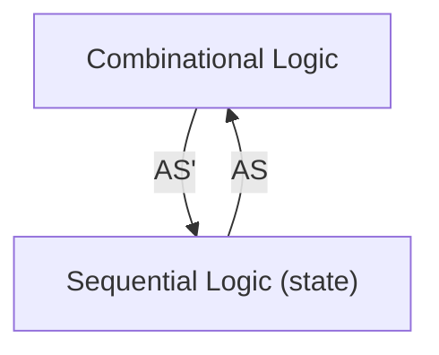
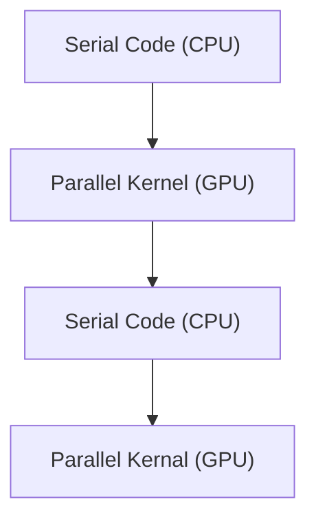

---
status:
  - archived
tags: CS/Language/CUDA
attachment:
  - "[[slides/6_gpus-architecture-2024.pdf|6_gpus-architecture-2024]]"
date_created: 2024-07-07T08:34:54
date_modified: 2025-09-12T15:23:19
---

# Part 1. Graphics Processing Units

## Roadmap

- ^ Many-core (GPU)
- ^ Inter-core Parallelism
- ^ Parallelism
- ^ Pipeline CPU
- ^ Multi-Cycle CPU
- ^ Single-Cycle CPU
- ^ Von Newmann Architecture

### Von Newmann Model

- Stored program
	- 指令和数据存储在统一的内存中
- Sequential instruction processing
	- 单线程
	- Program counter (instruction pointer) 决定了当前执行的指令

### Single-Cycle Microarchitecture



-  AS := Architectural state at the beginning of a clock cycle
- AS' := ~ at the end fo a clock cycle

### Multi-Cycle Microarchitecture

- Idea
	- 缩短周期
	- 每条指令执行多个周期
- ISA 决定了次态，对于 ISA 来说，没有中间状态
- 微架构实现了状态转换
	- single-cycle: AS --> AS'
	- multi-cycle: AS --> AS+MS1 --> AS+MS2 --> AS'

### Pipeline CPU

- Key idea: **process other instructions on idle resources**
- 将每个指令分成多个 stage，每个阶段执行不同的指令

## Why GPU?

### Programming Model: CPU and GPU



### Programming Model vs. Hardware Execution Model

- Programming Model: threads
	- sequential, SIMD, dataflow, MIMD, SPMD
- Hardware Execution Model: cores
	- out-of-order execution, vector processor, array processor, dataflow processor, multithreaded processor

### A GPU is a SIMD (SIMT) Machine

- Except it is not programmed using SIMD instructions
- It is *programmed using threads* (SPMD programming model)
	- 每个线程对不同的数据执行相同的操作
	- 每个线程可以被独立执行控制

## Programming Model

### SISD vs. SIMD vs. SPMD

#### Sequential SISD

#### Data Parallel SIMD

```txt title="C = A + B"
VLD  A -> V1
VLD  B -> V2
VADD V1 + V2 -> V3
VST  V3 -> C
```

#### Multithreaded SPMD (Single Program Multiple Data)

- Each iteration is independent
- 每个迭代（循环）都生成一个线程，每个线程都做相同的操作

## GPU Programming Example

### CUDA/OpenCL Programming Model

- SPMD, e.g. CUDA
- Hardware
	- Thread Grid: the whole set of threads
	- Thread Block
		- 是一种编程抽象，表示一组可以并行执行的线程
		- 一个 block 中共享内存，且时序同步
	- Thread: corresponds to an iteration

![[__assets/Lec.06 CUDA C 编程基础/IMG-Lec.06 CUDA C 编程基础-20250125073635242.webp]]

### CUDA Programming Language

```c
// Memory allocation
cudaMalloc((void**)&d_in, #bytes);

// Memory copy
cudaMemcpy(d_in, h_in, #bytes, cudaMemcpyHostToDevice);

// Kernel launch
kernel<<< #blocks, #threads >>>(args);

// Memory deallocation
cudaFree(d_in);

// Explicit synchronizaiton
cudaDeviceSynchronize();
```

#### CUDA example: vector addition

```c title="Vector addition"
void vecadd(float* A, float* B, float* C, int N) {

	// 1. allocate GPU memory
	float* A_d, B_d, C_d;
	cudaMalloc((void**) &A_d, N*sizeof(float));
	cudaMalloc((void**) &B_d, N*sizeof(float));
	cudaMalloc((void**) &C_d, N*sizeof(float));

	// 2. copy data to GPU memory
	cudaMemcpy(A_d, A, N*sizeof(float), cudaMemcpyHostToDevice);
	cudaMemcpy(B_d, B, N*sizeof(float), cudaMemcpyHostToDevice);

	// 3. perform computation on GPU
	const unsigned int numThreadsPerBlock = 512;
	const unsigned int numBlocks = N/numThreadsPerBlock;
	vecadd_kernel<<<numBlocks, numThreadsPerBlock>>>(A_d, B_d, C_d, N);

	// 4. copy data from GPU memory
	cudaMemcpy(C, C_d, N*sizeof(float), cudaMemcpyDeviceToHost)

	// 5. Deallocate GPU memory
	cudaFree(A_d);
	cudaFree(B_d);
	cudaFree(C_d);
}
```

##### Kernel code

```c title="vecadd_kernel"
__global__ void vecadd_kernel(float* A, float* B, float* C, int N) {
	int i = blockDim.x * blockIdx.x + threadIdx.x;
	if(i < N){
	    c[i] = A[i] + B[i];
	}
}
```

#### CUDA example: matrix multiplication

```c title="CUDA matrix multiplication"
__globall__ add_matrix(float* a, float* b, float* c, int N){
	int i = blockIdx.x * blockDim.x + threadIdx.x;
	int j = blockIdx * blockDim.y + threadIdx.y;
	int index = i + j * N;
	if(i < N && j < N){
	    c[index] = a[index] + b[index];
	}
}

int main(void){
	dim3 dimBlock(blocksize, blocksize);
	dim3 dimGrid(N / dimBlock.x, N / dimBlock.y);
	add_matrix<<<dimGrid, dimBlock>>>(a, b, c, N);
}
```

## SIMT (Hardware) & Warp (Software)

- SIMT: Single Instruction Multiple Thread
	- 16 CUDA cores in a SM are executed in a lock step
- Warp:
	- A warp, a basic execution unit, consists of 32 consecutive threads
	- A thread block is divided into warps for SIMT execution

# Part 2. CUDA C 编程基础

## 使用 CUDA C/C++ 加速应用程序

### Intro

获取系统中可用的 GPU 资源：

```sh
nvidia-smi
```

一个加速程序 `.cu` 样例：

```cpp
void CPUFunction()
{
  printf("This function is defined to run on the CPU.\n");
}

__global__ void GPUFunction()
{
  printf("This function is defined to run on the GPU.\n");
}

int main()
{
  CPUFunction();

  GPUFunction<<<1/* # of thread blocks */, 1/* # of threads per block*/>>>();
  cudaDeviceSynchronize();  // 同步 GPU 和 CPU 的工作
}
```

> [!NOTE]- 加速计算中的一些术语
> `__global__ void GPUFunction()`
>
> - `__global__` 关键字表明以下函数将在 GPU 上运行并可**全局**调用，而在此种情况下，则指由 CPU 或 GPU 调用。
> - 通常，我们将在 CPU 上执行的代码称为**主机**代码，而将在 GPU 上运行的代码称为**设备**代码。
> - 注意返回类型为 `void`。使用 `__global__` 关键字定义的函数需要返回 `void` 类型。
> 
> `GPUFunction<<<1, 1>>>();`
>
> - 通常，当调用要在 GPU 上运行的函数时，我们将此种函数称为**已启动**的**核函数**。
> - 启动核函数时，我们必须提供**执行配置**，即在向核函数传递任何预期参数之前使用 `<<< ... >>>` 语法完成的配置。
> - 在宏观层面，程序员可通过执行配置为核函数启动指定**线程层次结构**，从而定义线程组（称为**线程块**）的数量，以及要在每个线程块中执行的**线程**数量。稍后将在本实验深入探讨执行配置，但现在请注意正在使用包含 `1` 线程（第二个配置参数）的 `1` 线程块（第一个执行配置参数）启动核函数。
> 
> `cudaDeviceSynchronize();`
>
> - 与许多 C/C++ 代码不同，核函数启动方式为**异步**：CPU 代码将继续执行 _ 而无需等待核函数完成启动 _。
> - 调用 CUDA 运行时提供的函数 `cudaDeviceSynchronize` 将导致主机 (CPU) 代码暂作等待，直至设备 (GPU) 代码执行完成，才能在 CPU 上恢复执行。

编译命令：

```sh
nvcc -arch=[架构类型] -o out [some-CUDA.cu]
```

### CUDA 的线程层次结构

![[__assets/Lec.06 CUDA C 编程基础/IMG-Lec.06 CUDA C 编程基础-20250125073654952.webp]]

- Grid：核函数（GPU 函数）启动关联的块
- Block：线程块
- Thread：线程，每个网格中有相同的线程数

> [!NOTE] 启动并行运行的核函数
> 程序员可通过执行配置指定有关如何启动核函数以在多个 GPU **线程**中并行运行的详细信息。更准确地说，程序员可通过执行配置指定线程组（称为**线程块**或简称为**块**）数量以及其希望每个线程块所包含的线程数量。执行配置的语法如下：
>
> `<<< NUMBER_OF_BLOCKS, NUMBER_OF_THREADS_PER_BLOCK>>>`
>
> **启动核函数时，核函数代码由每个已配置的线程块中的每个线程执行**。
>
> 因此，如果假设已定义一个名为 `someKernel` 的核函数，则下列情况为真：
>
> - `someKernel<<<1, 1>>()` 配置为在具有单线程的单个线程块中运行后，将只运行一次。
> - `someKernel<<<1, 10>>()` 配置为在具有 10 线程的单个线程块中运行后，将运行 10 次。
> - `someKernel<<<10, 1>>()` 配置为在 10 个线程块（每个均具有单线程）中运行后，将运行 10 次。
> - `someKernel<<<10, 10>>()` 配置为在 10 个线程块（每个均具有 10 线程）中运行后，将运行 100 次。

> [!NOTE] 线程和块的索引
> 每个线程在其线程块内部均会被分配一个索引，从 `0` 开始。此外，每个线程块也会被分配一个索引，并从 `0` 开始。正如线程组成线程块，线程块又会组成**网格**，而网格是 CUDA 线程层次结构中级别最高的实体。简言之，CUDA 核函数在由一个或多个线程块组成的网格中执行，且每个线程块中均包含相同数量的一个或多个线程。
>
> CUDA 核函数可以访问能够识别如下两种索引的特殊变量：正在执行核函数的线程（位于线程块内）索引和线程所在的线程块（位于网格内）索引。这两种变量分别为 `threadIdx.x` 和 `blockIdx.x`。

> [!code] 练习：线程和块的索引
>
> ```c title="thread and block index"
> #include <stdio.h>
> 
> __global__ void printSuccessForCorrectExecutionConfiguration()
> {
>   if(threadIdx.x == 1023 && blockIdx.x == 255)
>   {
>     printf("Success!\n");
>   } else {
>     return;
>   }
> }
> 
> int main()
> {
>   printSuccessForCorrectExecutionConfiguration<<<256, 1024>>>();
>   cudaDeviceSynchronize();
> }
> ```

### 加速 for 循环

#### 单个 for 循环的加速

> [!code] 练习：使用单个线程加速 for 循环
>
> ```c title="使用单个线程加速 for 循环"
> #include <stdio.h>
> 
> __global__ void loop()
> {
>     printf("This is iteration number %d\n", threadIdx.x);
> }
> 
> int main()
> {
>   loop<<<1, 10>>>();
>   cudaDeviceSynchronize();
> }
> 
> ```

> [!attention] 顺序问题
> 当 thread 很大时，就会发现线程的执行结束顺序是不确定的。

#### 协调并行线程

![[__assets/Lec.06 CUDA C 编程基础/IMG-Lec.06 CUDA C 编程基础-20250125073708760.webp]]

可以通过使用 CUDA 提供的索引变量进行数据的分块。

> [!NOTE] 调整线程块的大小以实现更多的并行化
> 线程块包含的线程具有数量限制：确切地说是 1024 个。为增加加速应用程序中的并行量，我们必须要能在多个线程块之间进行协调。
>
> CUDA 核函数可以访问给出块中线程数的特殊变量：`blockDim.x`。通过将此变量与 `blockIdx.x` 和 `threadIdx.x` 变量结合使用，并借助惯用表达式 `threadIdx.x + blockIdx.x * blockDim.x` 在包含多个线程的多个线程块之间组织并行执行，并行性将得以提升。以下是详细示例。
>
> 执行配置 `<<<10, 10>>>` 将启动共计拥有 100 个线程的网格，这些线程均包含在由 10 个线程组成的 10 个线程块中。因此，我们希望每个线程（`0` 至 `99` 之间）都能计算该线程的某个唯一索引。
>
> - 如果线程块 `blockIdx.x` 等于 `0`，则 `blockIdx.x * blockDim.x` 为 `0`。向 `0` 添加可能的 `threadIdx.x` 值（`0` 至 `9`），之后便可在包含 100 个线程的网格内生成索引 `0` 至 `9`。
> - 如果线程块 `blockIdx.x` 等于 `1`，则 `blockIdx.x * blockDim.x` 为 `10`。向 `10` 添加可能的 `threadIdx.x` 值（`0` 至 `9`），之后便可在包含 100 个线程的网格内生成索引 `10` 至 `19`。
> - 如果线程块 `blockIdx.x` 等于 `5`，则 `blockIdx.x * blockDim.x` 为 `50`。向 `50` 添加可能的 `threadIdx.x` 值（`0` 至 `9`），之后便可在包含 100 个线程的网格内生成索引 `50` 至 `59`。
> - 如果线程块 `blockIdx.x` 等于 `9`，则 `blockIdx.x * blockDim.x` 为 `90`。向 `90` 添加可能的 `threadIdx.x` 值（`0` 至 `9`），之后便可在包含 100 个线程的网格内生成索引 `90` 至 `99`。

> [!code] 练习：加速具有多个线程块的 For 循环
>
> ```cpp
> #include <stdio.h>
> 
> __global__ void loop(int N)
> {
>     int i = threadIdx.x + blockIdx.x * blockDim.x;
>     if(i < N) printf("This is iteration number %d\n", i);  // 解决了网格大小和需求不匹配的问题
> }
> 
> int main()
> {
>   int N = 10;
>   loop<<<2, 10>>>(N);
>   cudaDeviceSynchronize();
> }
> ```

### GPU 内存分配

> [!attention]
> GPU 无法直接访问 CPU 内存

以下是使用 CUDA 分配内存的样例：

```cpp title="使用 CUDA api 分配 GPU 可用的内存空间"
int N = 2<<20;
size_t size = N * sizeof(int);

int *a;
// Note the address of `a` is passed as first argument.
cudaMallocManaged(&a, size);

// Use `a` on the CPU and/or on any GPU in the accelerated system.

cudaFree(a);
```

> [!code] 练习：主机和设备上的数组操作
>
> ```cpp
> #include <stdio.h>
> 
> void init(int *a, int N)
> {
>   int i;
>   for (i = 0; i < N; ++i)
>   {
>     a[i] = i;
>   }
> }
> 
> __global__ void doubleElements(int *a, int N)
> {
>   int i;
>   i = blockIdx.x * blockDim.x + threadIdx.x;
>   if (i < N)
>   {
>     a[i] *= 2;
>   }
> }
> 
> bool checkElementsAreDoubled(int *a, int N)
> {
>   int i;
>   for (i = 0; i < N; ++i)
>   {
>     if (a[i] != i*2) return false;
>   }
>   return true;
> }
> 
> int main()
> {
>   int N = 100;
>   int *a;
> 
>   size_t size = N * sizeof(int);
> 
>   cudaMallocManaged(&a, size);
> 
>   init(a, N);
> 
>   size_t threads_per_block = 10;
>   size_t number_of_blocks = 10;
> 
>   doubleElements<<<number_of_blocks, threads_per_block>>>(a, N);
>   cudaDeviceSynchronize();
> 
>   bool areDoubled = checkElementsAreDoubled(a, N);
>   printf("All elements were doubled? %s\n", areDoubled ? "TRUE" : "FALSE");
> 
>   cudaFree(a);
> }
> ```

### 解决不匹配问题

#### 如何处理块配置与所需线程数不匹配

> [!code] 练习：使用不匹配的执行配置来加速 For 循环
>
> ```cpp
> #include <stdio.h>
> 
> __global__ void initializeElementsTo(int initialValue, int *a, int N)
> {
>   int i = threadIdx.x + blockIdx.x * blockDim.x;
>   if(i < N) a[i] = initialValue;  // Problem solver
> }
> 
> int main()
> {
>   int N = 1000;
> 
>   int *a;
>   size_t size = N * sizeof(int);
> 
>   cudaMallocManaged(&a, size);
> 
>   size_t threads_per_block = 256;
> 
>   size_t number_of_blocks = 4;
> 
>   int initialValue = 6;
> 
>   initializeElementsTo<<<number_of_blocks, threads_per_block>>>(initialValue, a, N);
>   cudaDeviceSynchronize();
> 
>   for (int i = 0; i < N; ++i)
>   {
>     if(a[i] != initialValue)
>     {
>       printf("FAILURE: target value: %d\t a[%d]: %d\n", initialValue, i, a[i]);
>       exit(1);
>     }
>   }
>   printf("SUCCESS!\n");
> 
>   cudaFree(a);
> }
> 
> ```

#### 数据集比网格大

![[__assets/Lec.06 CUDA C 编程基础/IMG-Lec.06 CUDA C 编程基础-20250125073724747.webp]]

> [!NOTE] 使用 `gridDim.x` 实现跨网格循环
> CUDA 提供一个可给出网格中线程块数的特殊变量：`gridDim.x`。然后计算网格中的总线程数，即网格中的线程块数乘以每个线程块中的线程数：`gridDim.x * blockDim.x`。带着这样的想法来看看以下核函数中网格跨度循环的详细示例：
>
> ```cpp
> __global void kernel(int *a, int N)
> {
>   int indexWithinTheGrid = threadIdx.x + blockIdx.x * blockDim.x;
>   int gridStride = gridDim.x * blockDim.x;
> 
>   for (int i = indexWithinTheGrid; i < N; i += gridStride)
>   {
>     // do work on a[i];
>   }
> }
> ```

> [!code] 练习：使用跨网格循环来处理比网格更大的数组
>
> ```cpp
> #include <stdio.h>
> 
> void init(int *a, int N)
> {
>   int i;
>   for (i = 0; i < N; ++i)
>   {
>     a[i] = i;
>   }
> }
> 
> __global__
> void doubleElements(int *a, int N)
> {
>   int idx = blockIdx.x * blockDim.x + threadIdx.x;
>   int stride = gridDim.x * blockDim.x;
> 
>   for (int i = idx; i < N; i += stride)
>   {
>     a[i] *= 2;
>   }
> }
> 
> bool checkElementsAreDoubled(int *a, int N)
> {
>   int i;
>   for (i = 0; i < N; ++i)
>   {
>     if (a[i] != i*2) return false;
>   }
>   return true;
> }
> 
> int main()
> {
>   int N = 10000;
>   int *a;
> 
>   size_t size = N * sizeof(int);
>   cudaMallocManaged(&a, size);
> 
>   init(a, N);
> 
>   size_t threads_per_block = 256;
>   size_t number_of_blocks = 32;
> 
>   doubleElements<<<number_of_blocks, threads_per_block>>>(a, N);
>   cudaDeviceSynchronize();
> 
>   bool areDoubled = checkElementsAreDoubled(a, N);
>   printf("All elements were doubled? %s\n", areDoubled ? "TRUE" : "FALSE");
> 
>   cudaFree(a);
> }
> ```

### 错误处理

> [!NOTE] 基于 `cudaError_t` 类型的错误处理
> 与在任何应用程序中一样，加速 CUDA 代码中的错误处理同样至关重要。即便不是大多数，也有许多 CUDA 函数（例如，[内存管理函数](http://docs.nvidia.com/cuda/cuda-runtime-api/group__CUDART__MEMORY.html#group__CUDART__MEMORY)）会返回类型为 `cudaError_t` 的值，该值可用于检查调用函数时是否发生错误。以下是对调用 `cudaMallocManaged` 函数执行错误处理的示例：
>
> ```cpp
> cudaError_t err;
> err = cudaMallocManaged(&a, N)                    // Assume the existence of `a` and `N`.
> 
> if (err != cudaSuccess)                           // `cudaSuccess` is provided by CUDA.
> {
>   printf("Error: %s\n", cudaGetErrorString(err)); // `cudaGetErrorString` is provided by CUDA.
> }
> ```
>
> 启动定义为返回 `void` 的核函数后，将不会返回类型为 `cudaError_t` 的值。为检查启动核函数时是否发生错误（例如，如果启动配置错误），CUDA 提供 `cudaGetLastError` 函数，该函数会返回类型为 `cudaError_t` 的值。
>
> ```cpp
> /*
>  * This launch should cause an error, but the kernel itself
>  * cannot return it.
>  */
> 
> someKernel<<<1, -1>>>();  // -1 is not a valid number of threads.
> 
> cudaError_t err;
> err = cudaGetLastError(); // `cudaGetLastError` will return the error from above.
> if (err != cudaSuccess)
> {
>   printf("Error: %s\n", cudaGetErrorString(err));
> }
> ```
>
> 最后，为捕捉异步错误（例如，在异步核函数执行期间），请务必检查后续同步 CUDA 运行时 API 调用所返回的状态（例如 `cudaDeviceSynchronize`）；如果之前启动的其中一个核函数失败，则将返回错误。

> [!code] 练习：添加错误处理
>
> ```cpp
> #include <stdio.h>
> 
> void init(int *a, int N)
> {
>   int i;
>   for (i = 0; i < N; ++i)
>   {
>     a[i] = i;
>   }
> }
> 
> __global__
> void doubleElements(int *a, int N)
> {
> 
>   int idx = blockIdx.x * blockDim.x + threadIdx.x;
>   int stride = gridDim.x * blockDim.x;
> 
>   for (int i = idx; i < N + stride; i += stride)
>   {
>     a[i] *= 2;
>   }
> }
> 
> bool checkElementsAreDoubled(int *a, int N)
> {
>   int i;
>   for (i = 0; i < N; ++i)
>   {
>     if (a[i] != i*2) return false;
>   }
>   return true;
> }
> 
> int main()
> {
>   /*
>    * Add error handling to this source code to learn what errors
>    * exist, and then correct them. Googling error messages may be
>    * of service if actions for resolving them are not clear to you.
>    */
> 
>   int N = 10000;
>   int *a;
> 
>   size_t size = N * sizeof(int);
>   cudaMallocManaged(&a, size);
> 
>   init(a, N);
> 
>   size_t threads_per_block = 2048;
>   size_t number_of_blocks = 32;
> 
>   cudaError_t syncErr, asyncErr; 
>    
>   doubleElements<<<number_of_blocks, threads_per_block>>>(a, N);
>   syncErr = cudaGetLastError();
>    
>   asyncErr = cudaDeviceSynchronize();
> 
>   if (syncErr != cudaSuccess) printf("Error: %s\n", cudaGetErrorString(syncErr));
>   if (asyncErr != cudaSuccess) printf("Error: %s\n", cudaGetErrorString(asyncErr)); 
>    
>   bool areDoubled = checkElementsAreDoubled(a, N);
>   printf("All elements were doubled? %s\n", areDoubled ? "TRUE" : "FALSE");
> 
>   cudaFree(a);
> }
> ```
> 即进行如下步骤：
> 1. 创建 `cudaError_t` 变量
> 2. 收集错误信息 `syncErr = cudaGetLastError();  asyncErr = cudaDeviceSynchronize();`
> 3. 打印错误信息 `if(syncErr != cudaSucess) printf("Error: %s\n", cudaGetErrorString(err));`

> [!NOTE] CUDA 错误处理功能
> 创建一个包装 CUDA 函数调用的宏对于检查错误十分有用。以下是一个宏示例，您可以在余下练习中随时使用：
>
> ```cpp
> #include <stdio.h>
> #include <assert.h>
> 
> inline cudaError_t checkCuda(cudaError_t result)
> {
>   if (result != cudaSuccess) {
>     fprintf(stderr, "CUDA Runtime Error: %s\n", cudaGetErrorString(result));
>     assert(result == cudaSuccess);
>   }
>   return result;
> }
> 
> int main()
> {
> 
> /*
>  * The macro can be wrapped around any function returning
>  * a value of type `cudaError_t`.
>  */
> 
>   checkCuda( cudaDeviceSynchronize() )
> }
> ```

查看官方文档进一步学习：[CUDA Toolkit Documentation 12.5 (nvidia.com)](https://docs.nvidia.com/cuda/)

## 利用基本的 CUDA 内存管理技术来优化加速应用程序

### 性能分析

> [!NOTE] 使用 nsys 分析应用程序
> `nsys profile` 将生成一个 `qdrep` 报告文件，该文件可以以多种方式使用。 我们在这里使用 `--stats = true` 标志表示我们希望打印输出摘要统计信息。 输出的信息有很多，包括：
>
> - 配置文件配置详细信息
> - 报告文件的生成详细信息
> - **CUDA API 统计信息**
> - **CUDA 核函数的统计信息**
> - **CUDA 内存操作统计信息（时间和大小）**
> - 操作系统内核调用接口的统计信息
> 
> 在本实验中，您将主要使用上面**黑体字**的 3 个部分。 在下一个实验中，您将使用生成的报告文件将其提供给 Nsight Systems 进行可视化分析。
>
> 应用程序分析完毕后，请使用分析输出中显示的信息回答下列问题：
>
> - 此应用程序中唯一调用的 CUDA 核函数的名称是什么？
> - 此核函数运行了多少次？
> - 此核函数的运行时间为多少？请记录下此时间：您将继续优化此应用程序，再和此时间做对比。
> ```
> CUDA Kernel Statistics (nanoseconds)
> Time(%)      Total Time   Instances         Average         Minimum         Maximum  Name                                                                            
> -------  --------------  ----------  --------------  --------------  --------------  --------------------------------------------------------------------------------
>  100.0      2330194366           1    2330194366.0      2330194366      2330194366  addVectorsInto
>  ```

> [!code] 练习：优化并分析性能
> - 即通过 nsys 输出来调节核函数的启动参数

### 流式多处理器 (Streaming Multiprocessors)

- 线程块需要映射到 SM 上，一个 SM 只能处理一个线程块
- 线程块会被发射到 SM 上，这个顺序是不确定的，所以并行执行暗示了没有顺序
- ![[__assets/Lec.06 CUDA C 编程基础/IMG-Lec.06 CUDA C 编程基础-20250125073742930.webp]]

### 查询设备信息

> [!NOTE] 以编程方式查询 GPU 设备属性
> 由于 GPU 上的 SM 数量会因所用的特定 GPU 而异，因此为支持可移植性，您不得将 SM 数量硬编码到代码库中。相反，应该以编程方式获取此信息。
>
> 以下所示为在 CUDA C/C++ 中获取 C 结构的方法，该结构包含当前处于活动状态的 GPU 设备的多个属性，其中包括设备的 SM 数量：
>
> ```cpp
> int deviceId;
> cudaGetDevice(&deviceId);                  // `deviceId` now points to the id of the currently active GPU.
> 
> cudaDeviceProp props;
> cudaGetDeviceProperties(&props, deviceId); // `props` now has many useful properties about
>                                            // the active GPU device.
> ```

> [!NOTE] 练习：查询设备信息
>
> ```cpp
> #include <stdio.h>
> 
> int main()
> {
>   /*
>    * Device ID is required first to query the device.
>    */
> 
>   int deviceId;
>   cudaGetDevice(&deviceId);
> 
>   cudaDeviceProp props;
>   cudaGetDeviceProperties(&props, deviceId);
> 
>   int computeCapabilityMajor = props.major;
>   int computeCapabilityMinor = props.minor;
>   int multiProcessorCount = props.multiProcessorCount;
>   int warpSize = props.warpSize;
> 
> 
>   printf("Device ID: %d\nNumber of SMs: %d\nCompute Capability Major: %d\nCompute Capability Minor: %d\nWarp Size: %d\n", deviceId, multiProcessorCount, computeCapabilityMajor, computeCapabilityMinor, warpSize);
> }
> ```
>
> 得到的输出为：
>
> ```
> Device ID: 0
> Number of SMs: 40
> Compute Capability Major: 7
> Compute Capability Minor: 5
> Warp Size: 32
> ```
>
> **将网格数调整为 SM 数，可以进一步优化矢量加法。**

## 被加速的 C/C++ 应用程序的异步流和可视化分析

### 并发 CUDA 流

![[__assets/Lec.06 CUDA C 编程基础/IMG-Lec.06 CUDA C 编程基础-20250125073757344.webp]]

> [!NOTE] 创建，使用和销毁非默认 CUDA 流
> 以下代码段演示了如何创建，利用和销毁非默认 CUDA 流。您会注意到，要在非默认 CUDA 流中启动 CUDA 核函数，必须将流作为执行配置的第 4 个可选参数传递给该核函数。到目前为止，您仅利用了执行配置的前两个参数：
>
> ```C++
> cudaStream_t stream;   // CUDA流的类型为 `cudaStream_t`
> cudaStreamCreate(&stream); // 注意，必须将一个指针传递给 `cudaCreateStream`
> 
> someKernel<<<number_of_blocks, threads_per_block, 0, stream>>>();   // `stream` 作为第4个EC参数传递
> 
> cudaStreamDestroy(stream); // 注意，将值（而不是指针）传递给 `cudaDestroyStream`
> ```
>
> 但值得一提的是，执行配置的第 3 个可选参数超出了本实验的范围。此参数允许程序员提供**共享内存**（当前将不涉及的高级主题）中为每个内核启动动态分配的字节数。每个块分配给共享内存的默认字节数为“0”，在本练习的其余部分中，您将传递“ 0”作为该值，以便展示我们感兴趣的第 4 个参数。

## 大作业：优化 n 体系统模拟器

### 思路

1. 改写 `bodyForce` 函数，使用 GPU 加速计算
	1. 使用 `__global__`
	2. 使用 `idx` 来映射数据块
2. 得到 SM 数量，以指导 blockNum 设置
	1. 使用 `cudaGetDevice(&deviceID)`<br>`cudaDeviceGetAttribute(&numberOfSMs, cudaDevAttrMultiProcessorCount, deviceId)`
3. 进行 GPU 内存分配 `cudaMallocManaged(&buf, bytes)`
4. 预取操作 `cudaMemPrefetchAsync(p, bytes, deviceId)`
5. 使用非默认流 `cudaCreateStream(&stream)`

```cpp hl=21-24,45,46,48,49,78,82,100,101,103,105,106,111,131 title="Solution"
#include <math.h>
#include <stdio.h>
#include <stdlib.h>
#include "timer.h"
#include "files.h"

#define SOFTENING 1e-9f

/*
 * Each body contains x, y, and z coordinate positions,
 * as well as velocities in the x, y, and z directions.
 */

typedef struct { float x, y, z, vx, vy, vz; } Body;

/*
 * Calculate the gravitational impact of all bodies in the system
 * on all others.
 */

__global__ void bodyForce(Body *p, float dt, int n) {
  int idx = threadIdx.x + blockIdx.x * blockDim.x;
  int stride = blockDim.x * gridDim.x;
  for (int i = idx; i < n; i += stride) {
    float Fx = 0.0f; float Fy = 0.0f; float Fz = 0.0f;

    for (int j = 0; j < n; j++) {
      float dx = p[j].x - p[i].x;
      float dy = p[j].y - p[i].y;
      float dz = p[j].z - p[i].z;
      float distSqr = dx*dx + dy*dy + dz*dz + SOFTENING;
      float invDist = rsqrtf(distSqr);
      float invDist3 = invDist * invDist * invDist;

      Fx += dx * invDist3; Fy += dy * invDist3; Fz += dz * invDist3;
    }

    p[i].vx += dt*Fx; p[i].vy += dt*Fy; p[i].vz += dt*Fz;
  }
}


int main(const int argc, const char** argv) {
    
  int deviceId;
  int numberOfSMs;

  cudaGetDevice(&deviceId);
  cudaDeviceGetAttribute(&numberOfSMs, cudaDevAttrMultiProcessorCount, deviceId);

  // The assessment will test against both 2<11 and 2<15.
  // Feel free to pass the command line argument 15 when you gernate ./nbody report files
  int nBodies = 2<<11;
  if (argc > 1) nBodies = 2<<atoi(argv[1]);

  // The assessment will pass hidden initialized values to check for correctness.
  // You should not make changes to these files, or else the assessment will not work.
  const char * initialized_values;
  const char * solution_values;

  if (nBodies == 2<<11) {
    initialized_values = "files/initialized_4096";
    solution_values = "files/solution_4096";
  } else { // nBodies == 2<<15
    initialized_values = "files/initialized_65536";
    solution_values = "files/solution_65536";
  }

  if (argc > 2) initialized_values = argv[2];
  if (argc > 3) solution_values = argv[3];

  const float dt = 0.01f; // Time step
  const int nIters = 10;  // Simulation iterations

  int bytes = nBodies * sizeof(Body);
  float *buf;

  cudaMallocManaged(&buf, bytes);

  Body *p = (Body*)buf;
    
  cudaMemPrefetchAsync(p, bytes, deviceId);

  read_values_from_file(initialized_values, buf, bytes);

  double totalTime = 0.0;

  /*
   * This simulation will run for 10 cycles of time, calculating gravitational
   * interaction amongst bodies, and adjusting their positions to reflect.
   */

  for (int iter = 0; iter < nIters; iter++) {
    StartTimer();

  /*
   * You will likely wish to refactor the work being done in `bodyForce`,
   * and potentially the work to integrate the positions.
   */
    cudaStream_t stream;
    cudaStreamCreate(&stream);
      
    int blockNum = nBodies / 512;

    bodyForce<<<blockNum, 512, 0, stream>>>(p, dt, nBodies); // compute interbody forces
    cudaStreamDestroy(stream);
  /*
   * This position integration cannot occur until this round of `bodyForce` has completed.
   * Also, the next round of `bodyForce` cannot begin until the integration is complete.
   */
    cudaDeviceSynchronize();
    for (int i = 0 ; i < nBodies; i++) { // integrate position
      p[i].x += p[i].vx*dt;
      p[i].y += p[i].vy*dt;
      p[i].z += p[i].vz*dt;
    }

    const double tElapsed = GetTimer() / 1000.0;
    totalTime += tElapsed;
  }

  double avgTime = totalTime / (double)(nIters);
  float billionsOfOpsPerSecond = 1e-9 * nBodies * nBodies / avgTime;
  write_values_to_file(solution_values, buf, bytes);

  // You will likely enjoy watching this value grow as you accelerate the application,
  // but beware that a failure to correctly synchronize the device might result in
  // unrealistically high values.
  printf("%0.3f Billion Interactions / second", billionsOfOpsPerSecond);

  cudaFree(buf);
}
```
